# 四 Linux C++命令行调试

## 1. 准备代码

创建一个C++源代码文件 `src/04_debug/sum.cpp`，添加以下代码

```cpp
#include <iostream>
using namespace std;

int main(int argc, char const *argv[])
{
    int N = 100;
    int sum = 0;
    int i = 1;
    
    while(i <= N){
        sum = sum + i;
        i = i + 1;
    }
    
    cout << "sum = " << sum <<endl;
    cout << "The program is over " <<endl;
    
    return 0;
}
```

## 2. 进入调试模式

在进入调试模式之前，先编译源代码，如下过程。

普通编译方式

```shell
g++ sum.cpp -o no_g.out
```

编译出用于调试的可执行文件

```shell
g++ -g sum.cpp -o yes_g.out
```

使用`gdb`命令进行调试，如果我们调试 `no_g.out` ，将会提示一下图错误

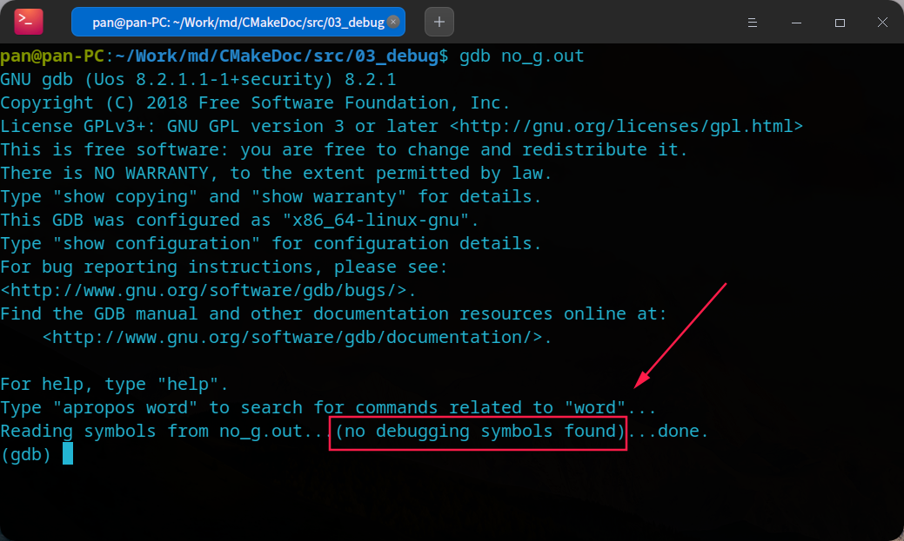

因为`no_g.out`这个可执行文件不包含用于调试的信息，输入`quit`再按回车即可，通过`gdb yes_g.out`指令执行包含调试信息的可执行文件，看到以下输出

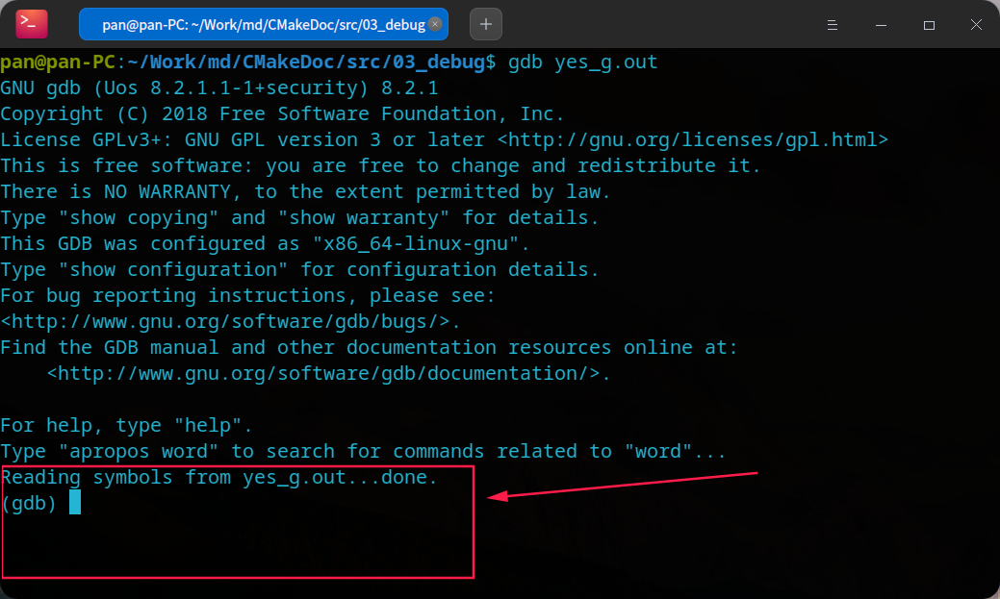

此时可以正常进入调试

## 3. 调试过程

直接执行

```shell
run
```

或者使用简写`r`，运行结果如下图

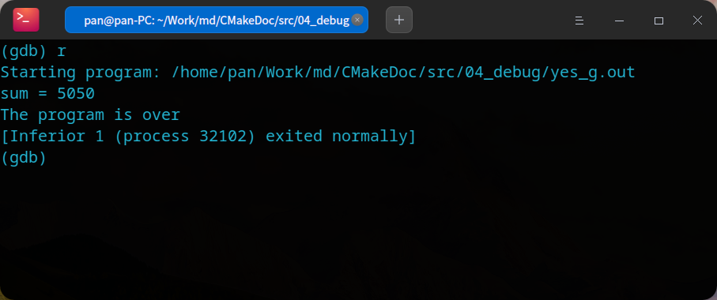

在第11行打断点

```shell
break 11
```

运行结果如下图

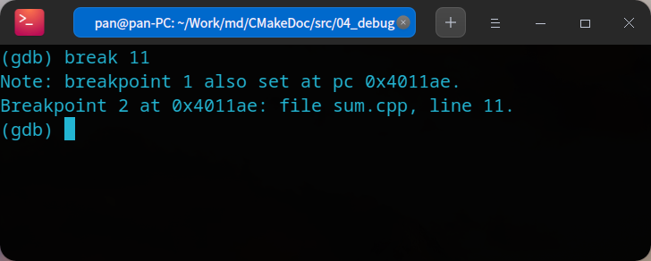

也可以使用简写的方式，在第12行打断点

```shell
b 12
```

结果如下图

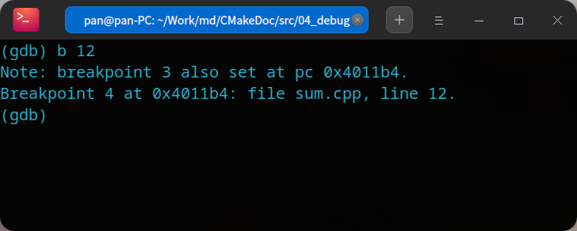

使用`info break`指令或者指令简写`i b`查看当前的断点，如下图结果

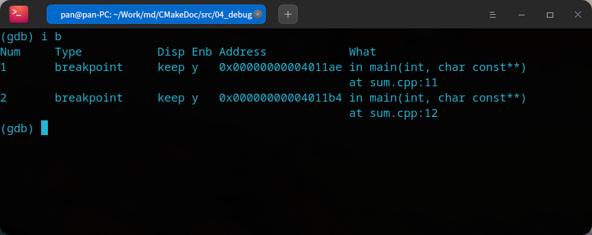

使用`run`指令或者`r`指令执行程序，此时命中了第11行断点，如下图内容

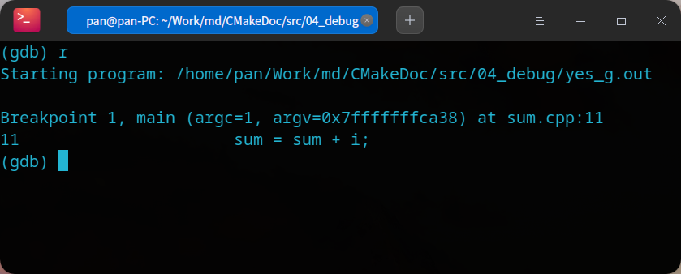

此时可以查看变量的值，如查看i的值，可以使用`print i`或者`p i`指令，如下图

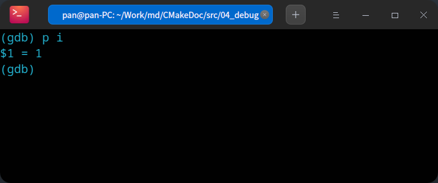

使用`p N` 查看N的值，如下图

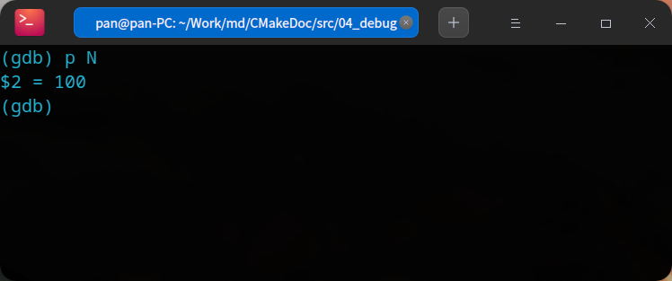

此时程序执行到第11行处，如果我们需要继续执行，输入`continue`指令并按回车即可，程序将执行到代码的第12行，如下图

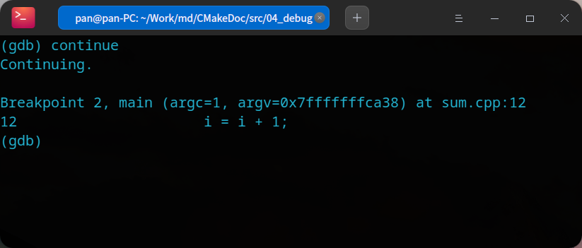

因为我们是在`while`循环体内，`i`的值将不断变化，如果我们需要跟中`i`值的变化，需要输入`display i`指令即可，再输入`continue`指令让程序单步执行，如下图

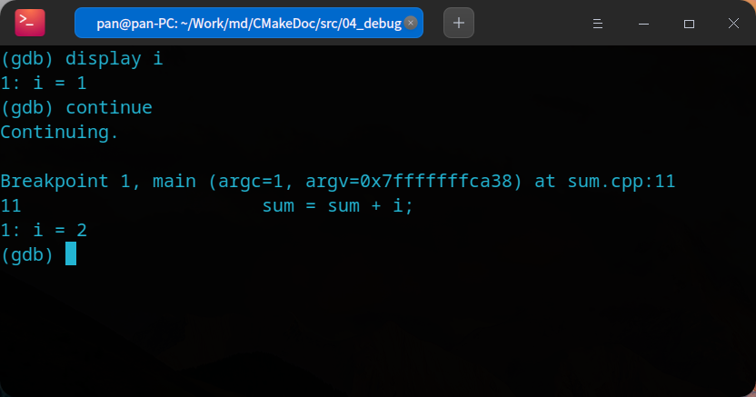

可以观察到，通过循环，又回到了第一个断点，此时`i`的值已经变成了2。在gdb调试中，如果我们只按回车键，gdb将执行我们最后一次输入的指令，所以我们可以一直按回车键继续让程序单步执行。

当断点执行都某个位置时，我们想要查看断点附近的代码，可以执行`list`指令进行查看，如下图

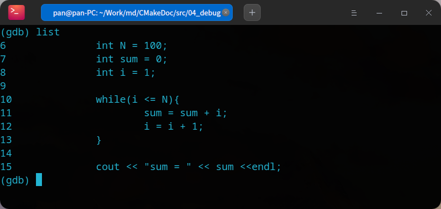
