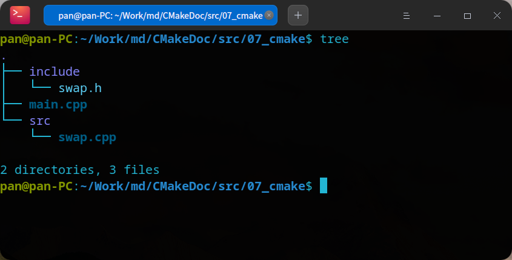
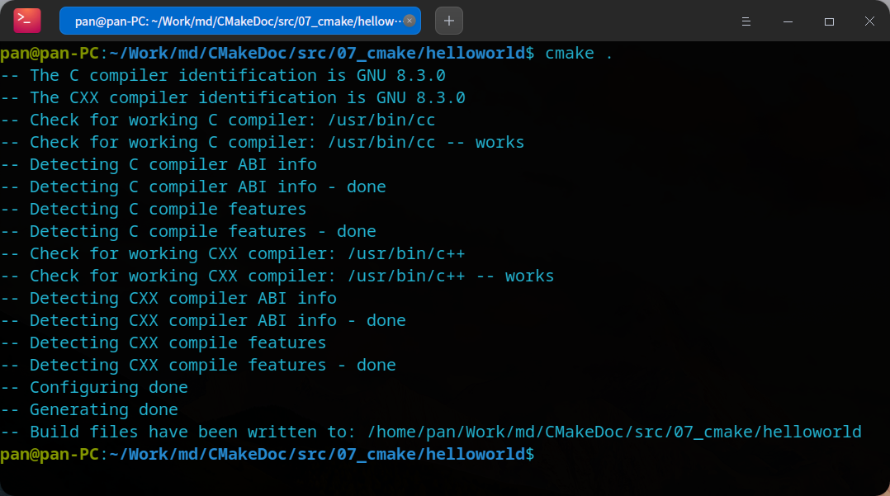
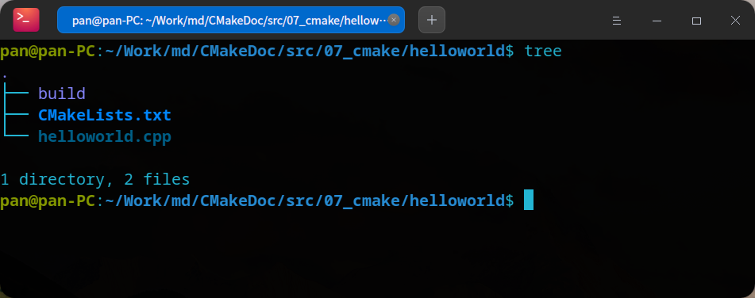
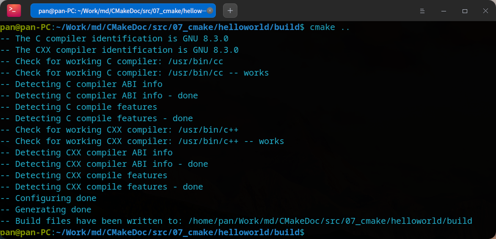

# 七 CMake项目编译实战

## 1. 准备源代码

> 我们准备两份源代码，一是最简单的 `helleworld` 程序，二是包含多文件的一个简单项目

### 1.1. 准备 `helloworld` 程序

我们在 `src/07_cmake/helloworld` 中创建 `helloworld.cpp` 源代码文件，添加以下内容

```cpp
#include <iostream>
using namespace std;

int main(int argc, char const *argv[])
{
    cout << "hello world !" << endl;
    return 0;
}
```

### 1.2. 准备一个多文件项目

在本系列的第2篇文章中，我们创建了一个简单的 C++ 项目，我们现在直接把源代码拷贝一份到 `src/07_cmake/project` 目录中，代码结构如下如所示



代码细节如下

`include/swap.h` 文件

```cpp
#include <iostream>
using namespace std;
```

`src/swap.cpp` 文件

```cpp
#include "swap.h"

void swap(int &a, int &b)
{
    int temp;
    temp = a;
    a = b;
    b = temp;
}
```

`main.cpp` 文件

```cpp
#include <iostream>
#include "swap.h"
using namespace std;

int main(int argc, char const *argv[])
{
    int val1 = 10;
    int val2 = 20;

    cout << " Before swap:" << endl;
    cout << " val1:" << val1 << endl;
    cout << " val2:" << val2 << endl;

    swap(val1, val2);

    cout << " After swap:" << endl;
    cout << " val1:" << val1 << endl;
    cout << " val2:" << val2 << endl;

    return 0;
}

```

## 2. 编译过程

### 2.1. 编译 `helloworld` 程序

- 内部构建

先执行 `cd src/07_cmake/helloworld` 命令进入我们的项目目录，创建 cmake 配置文件 `CMakeLists.txt`，定义编译参数如下内容

```shell
# 指定cmake最低版本
cmake_minimum_required(VERSION 3.0)
# 指定项目名称为 HELLOWORLD
project(HELLOWORLD)
# 编译源代码文件 helloword.cpp，生成可执行文件 helloworld_cmake.out
add_executable(helloworld_cmake.out helloworld.cpp)
```

在当前目录使用 `cmake .` 指令去解析 `CMakeLists.txt`，可以看到如下图的提示过程



指令执行结束后，产生很多临时文件的同时，并产生了 `Makefile` 文件。实际上，`cmake` 的作用就是简化生成 `Makefile` 的过程，有了 `Makefile`，就可以使用 `make` 指令执行编译了，如下图


指令执行结束后，我们得到了最终的可执行文件 `helloworld_cmake.out`

- 外部构建

使用内部构建的方式在源码目录下产生了很多无用的临时文件，使得我们的源码目录杂乱无章，更推荐的方式是使用外部构建。下面我们使用外部建构的方式 编译源代码，以下是详细的步骤

在上面的内部构建中，产生了很多临时文件，我们现在源码目录中只需要保留 `helloworld.cpp` 和 `CMakeLists.txt` 文件，删除掉其他文件。再创建 `build`目录，如下指令

```shell
# 新建build目录
mkdir build
# 进入build目录
cd build
```

现在的目录结构如下如所示




我们在 `build` 目录中进行编译，而源代码在上一级目录，所以我们使用 `..` 指向上级目录，并执行 `CMakeLists.txt` 的解析，如下命令

```shell
cmake ..
```

执行过程如下图所示



此时，所有的编译过程中间文件都在 `build` 目录中，我们在使用 `make` 命令编译出最后的 可执行文件，如下如


最终产生的可执行文件也在 `build` 目录中。

### 2.2. 编译 `project` 项目

在 `src/07_cmake/project` 目录下，是一个包含多文件的简单的 C++ 项目，接下来我们将使用 `cmake` 对项目进行编译。

新建 cmake 的配置文件 `src/07_cmake/project/CMakeLists.txt` ，并添加以下内容

```shell
# 指定最低cmake版本
cmake_minimum_required(VERSION 3.0)
# 指定项目名称为 SWAP 
project(SWAP)
# 引入头文件目录
include_directories(include)
# 生成可执行文件
add_executable(main_cmake.out main.cpp src/swap.cpp)
```

为了更好的管理源代码，我们使用外部编译的方式对代码进行编译，如下命令

```shell
# 创建编译临时目录
mkdir build
# 进入编译临时目录
cd build
# 解析 cmake 配置文件生成 Makefile
cmake ..
# 编译 
make
```

最终，在 `build` 目录中生成了最终的可执行文件 `main_cmake.out`。
