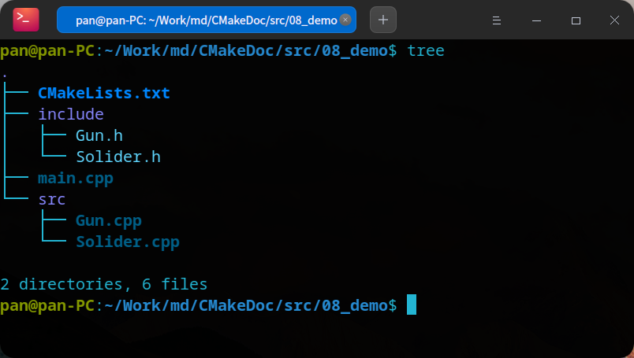
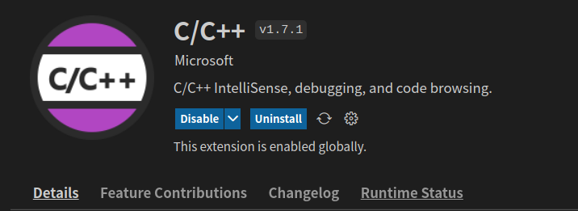
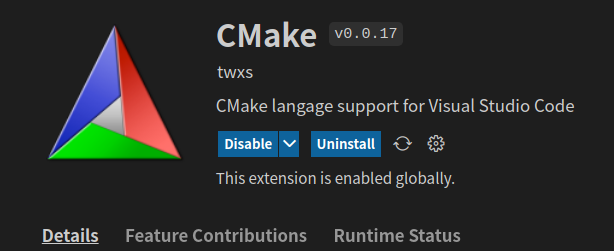
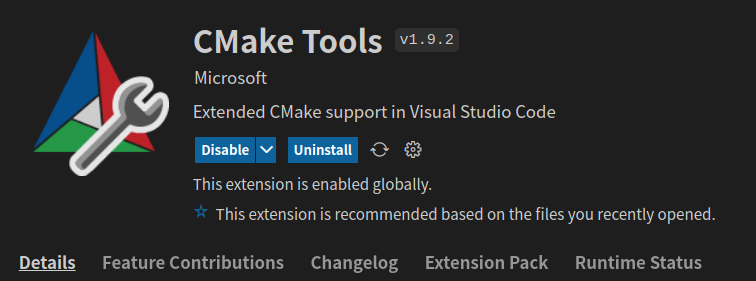
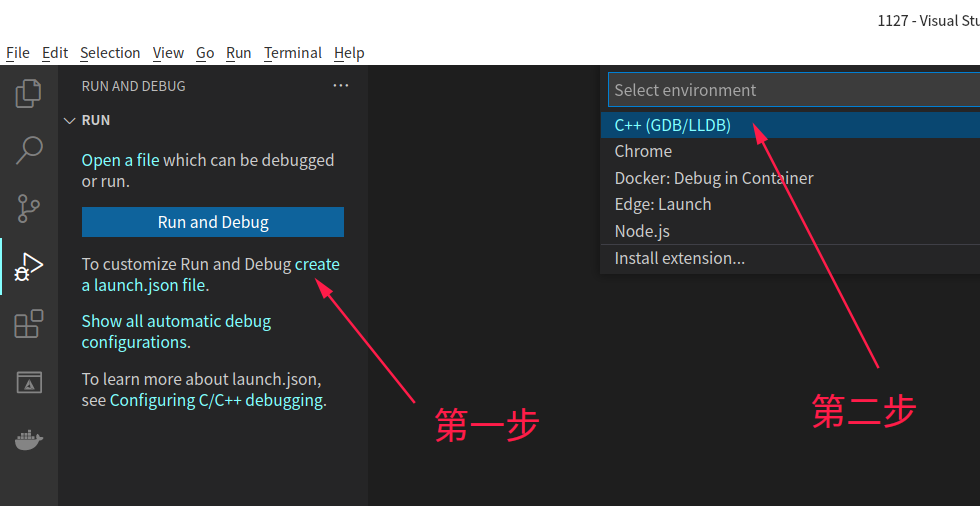
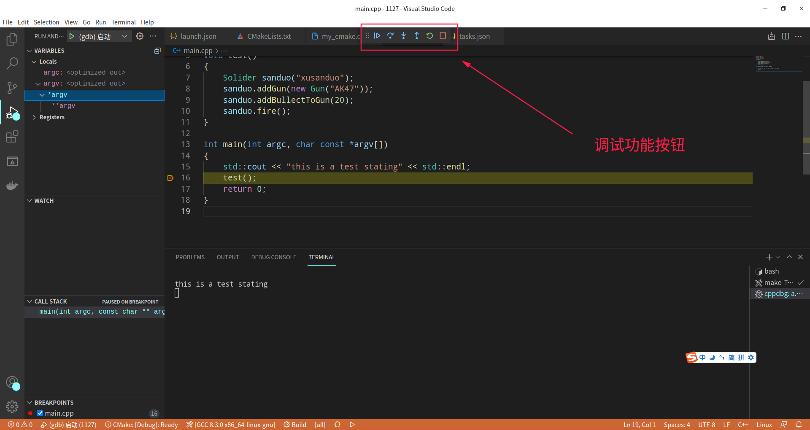

# 八 VSCode中调试C++程序

## 1. 概述

VSCode 是目前最热门的IDE之一，在本节，我们将介绍怎样在 VSCode 中进行 C++ 程序的调试。在开始之前，需要通过 [VSCode官网](https://code.visualstudio.com/)下载对应操作系统的最新版本，并安装到自己的电脑上。

> 这篇文章并不会涉及 VSCode 的基本操作，比如创建项目、安装插件、设置 等等的知识。如果你还不熟悉 VSCode ，建议先了解 VSCode 的基本使用方法。但如果你之前没有使用 CSCode 而是使用其他的开发工具，VSCode 对你来说上手也会很快。
> 

## 2. 准备源代码

使用 `src/08_demo` 目录作为源码目录，并添加如下图的文件



该程序模拟了一个士兵用枪装子弹，并进行射击的程序。相关源码内容以及cmake配置文件如下

### 2.1. `include/Gun.h` 文件

```cpp
#pragma once
#include <string>

class Gun
{
private:
    int _bullet_count;
    std::string _type;

public:
    Gun(std::string type)
    {
        this->_bullet_count = 0;
        this->_type = type;
    }

    void addBullet(int bullet_num);
    bool shoot();
};
```

### 2.2. `include/Solider.h` 文件

```cpp
#pragma once
#include <string>
#include "Gun.h"

class Solider
{
private:
    std::string _name;
    Gun *_ptr_gun;

public:
    Solider(std::string name);
    ~Solider();
    void addGun(Gun *ptr_gun);
    void addBullectToGun(int num);
    bool fire();
};
```

### 2.3. `src/Gun.cpp` 文件

```cpp
#include "Gun.h"
#include "iostream"
using namespace std;

void Gun::addBullet(int bullet_num)
{
    this->_bullet_count += bullet_num;
}

bool Gun::shoot()
{
    if (this->_bullet_count <= 0)
    {
        cout << "There is no bullet!" << endl;
        return false;
    }

    this->_bullet_count -= 1;
    cout << "shoot success" << endl;
    return true;
}
```

### 2.4. `src/Solider.cpp` 文件

```cpp
#include "Solider.h"

Solider::Solider(std::string name)
{
    this->_name = name;
    this->_ptr_gun = nullptr;
}

void Solider::addGun(Gun *ptr_gun)
{
    this->_ptr_gun = ptr_gun;
}

void Solider::addBullectToGun(int num)
{
    this->_ptr_gun->addBullet(num);
}

bool Solider::fire()
{
    return this->_ptr_gun->shoot();
}

Solider::~Solider()
{
    if (this->_ptr_gun == nullptr)
    {
        return;
    }
    delete this->_ptr_gun;
    this->_ptr_gun = nullptr;
}
```

### 2.5. `main.cpp` 文件

```cpp
#include "Gun.h"
#include "Solider.h"

void test()
{
    Solider sanduo("xusanduo");
    sanduo.addGun(new Gun("AK47"));
    sanduo.addBullectToGun(20);
    sanduo.fire();
}

int main(int argc, char const *argv[])
{
    test();
    return 0;
}
```

### 2.6. `CMakeLists.txt` 文件

```text
# 指定cmake版本
cmake_minimum_required(VERSION 3.0)
# 设置项目名称
project(SOLIDERFIRE)
# 添加编译参数
set(CMAKE_CXX_FLAGS "${CMAKE_CXX_FLAGS} -g -O2 -Wall")
# 设置代码构建级别为 Debug 方式
set(CMAKE_BUILD_TYPE Debug)
# 包含目录
include_directories(${CMAKE_SOURCE_DIR}/include)
# 编译
add_executable(a.out main.cpp src/Gun.cpp src/Solider.cpp)
```

## 3. 安装VSCode插件

### 3.1. `C/C++` 插件

该插件支持 C/C++ 代码的提示、C++程序调试 以及 C++源码的阅读，是 VSCode 的官方插件

插件地址: [https://marketplace.visualstudio.com/items?itemName=ms-vscode.cpptools](https://marketplace.visualstudio.com/items?itemName=ms-vscode.cpptools)



### 3.2. `CMake` 插件

该插件支持 CMake 配置文件的高亮代码、语法提示

插件地址: [https://marketplace.visualstudio.com/items?itemName=twxs.cmake](https://marketplace.visualstudio.com/items?itemName=twxs.cmake)



### 3.3. `CMake Tools` 插件

该插件也是 VSCode 的官方插件，提供 CMake 工具相关功能的支持

插件地址: [https://marketplace.visualstudio.com/items?itemName=ms-vscode.cmake-tools](https://marketplace.visualstudio.com/items?itemName=ms-vscode.cmake-tools)



## 4. 配置调试

### 4.1. 创建调试配置文件

准备好源代码并且安装好插件之后，我们可以打开 VSCode 的 调试(debug) 菜单栏，如下图



通过点击图示中的菜单创建 VSCode 的C++调试(debug)配置文件，此时在 `.vscode` 目录下创建一个名为 `launch.json` 的配置文件，我们将基于该文件定义debug 相关配置，默认的文件内容如下

```json
{
    // Use IntelliSense to learn about possible attributes.
    // Hover to view descriptions of existing attributes.
    // For more information, visit: https://go.microsoft.com/fwlink/?linkid=830387
    "version": "0.2.0",
    "configurations": [
        {
            "name": "(gdb) 启动",
            "type": "cppdbg",
            "request": "launch",
            "program": "输入程序名称，例如 ${workspaceFolder}/a.out",
            "args": [],
            "stopAtEntry": false,
            "cwd": "${fileDirname}",
            "environment": [],
            "externalConsole": false,
            "MIMode": "gdb",
            "setupCommands": [
                {
                    "description": "为 gdb 启用整齐打印",
                    "text": "-enable-pretty-printing",
                    "ignoreFailures": true
                }
            ]
        }
    ]
}
```

### 4.2. 关键参数：

`program`: 该配置的值指向带调试信息的二进制程序。我们最终将编译生成的程序放在 `build` 目录中，所以这里可以填写 `${workspaceFolder}/build/a.out`。


`preLaunchTask`: 该参数定义调试器启动之前的执行任务。默认配置文件中并不包含该参数，我们需要手动添加，用于自动编译变更后的 C++ 代码。


### 4.3. 创建任务文件

通过 `terminal` -> `Configure Default Build Task` 菜单，并选择 `Create tasks.json file from template` -> `Others` 选项创建任务配置文件，文件创建位置为 `.vscode/tasks.json`，默认配置内容如下

```json
{
    // See https://go.microsoft.com/fwlink/?LinkId=733558
    // for the documentation about the tasks.json format
    "version": "2.0.0",
    "tasks": [
        {
            "label": "echo",
            "type": "shell",
            "command": "echo Hello"
        }
    ]
}
```

我们需要将任务配置文件修改为如下内容

```json
{
    // See https://go.microsoft.com/fwlink/?LinkId=733558
    // for the documentation about the tasks.json format
    "version": "2.0.0",
    "options": {
        "cwd": "${workspaceFolder}/build"
    },
    "tasks": [
        {
            "type": "shell",
            "label": "cmake",
            "command": "cmake",
            "args": [
                ".."
            ]
        },
        {
            "label": "make",
            "group": {
                "kind": "build",
                "isDefault": true
            },
            "command": "make",
            "args": []
        },
        {
            "label": "build",
            "dependsOrder": "sequence",
            "dependsOn": [
                "cmake",
                "make"
            ]
        }
    ],
}
```

在以上的任务配置内容中，我们定义了三个任务。首先是定义了 `cmake` 预编译指令，其次是定义 `make` 编译指令，再定义 `build` 任务去包含预编译和编译这两个步骤。最终修改`launch.json` 文件如下内容

```json
{
    // Use IntelliSense to learn about possible attributes.
    // Hover to view descriptions of existing attributes.
    // For more information, visit: https://go.microsoft.com/fwlink/?linkid=830387
    "version": "0.2.0",
    "configurations": [
        {
            "name": "(gdb) 启动",
            "type": "cppdbg",
            "request": "launch",
            "program": "${workspaceFolder}/build/a.out",
            "args": [],
            "stopAtEntry": false,
            "cwd": "${fileDirname}",
            "environment": [],
            "externalConsole": false,
            "MIMode": "gdb",
            "setupCommands": [
                {
                    "description": "为 gdb 启用整齐打印",
                    "text": "-enable-pretty-printing",
                    "ignoreFailures": true
                }
            ],
            "preLaunchTask": "build"
        }
    ]
}
```

此时，VSCode 的自动化 debug 已经完成配置，要注意的是 `program` 配置的可执行程序的路径要和 `CMakeLists.txt` 配置文件中定义的二进制可执行程序 输出路径一致。同时，`preLaunchTask` 配置的值要和 `taks.json` 文件中配置的任务标识一致。


## 5. 调试过程

我们在第4步骤配置好自动化编译之后，现在我们在程序执行的`mian` 函数里添加如下一行代码来验证结果

```cpp
std::cout << "this is a test stating" << std::endl;
```

因为我们使用了C++标准输出函数，所以同时要在文件头部引入 `iostream`，如下代码

```cpp
#include "iostream"
```

同时在这行代码的下一行打一个断点，再按键盘上的 `F5` 键，此时自动进入了调试模式，如下图




在 VSCode 的调试包含了 以下几个功能按键：

- **Continue(F5)**: 执行到断点会停止

- **Step Into(F11)**: 进入子函数，单步执行

- **Step Out(Shift + F11)**: 越过子函数

- **Step Over(F10)**: 如果已经进入了子函数，越出此子函数

- **Restart(Ctrl + Shift + F5)**: 重启调试

- **Sop(Shift + F5)**: 停止调试