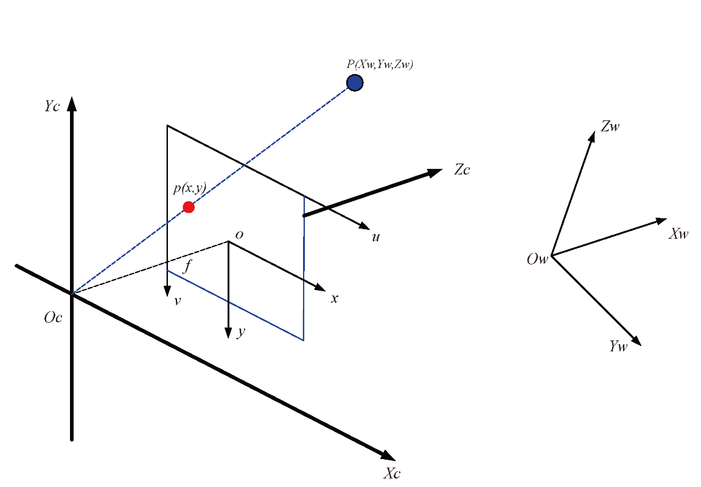

# 成像基础


## 1. 世界、相机、图像和像素坐标转换

### 1.1 坐标系几何关系



图像处理中涉及到以下四个坐标系：  
* $O_w - X_wY_wZ_w$ : 世界坐标系， 描述相机位置， 单位： m  
* $O_c - X_cY_cZ_c$: 相机坐标系， 光心为原点，单位： m  
* $O_{xy}$: 图像坐标系，光心为图像中点，单位： mm  
* $uv$: 像素坐标系，原点为图像左上角，单位: pixel  
* $P$: 世界坐标系中的一点，即为生活中真实的一点；  
* $p$: 点P在图像中的成像点，在图像坐标系中的坐标为$(x, y)$, 在像素坐标系中的坐标为$(u, v)$  
* $f$：相机焦距，等于$o$与$O_c$的距离，$f = ||o - O_c||$  


### 1.2 世界、相机坐标系转换


从世界坐标系变换到相机坐标系属于刚体变换： 即物体不会发生形变，只需要进行旋转和平移。
$R$: 表示旋转矩阵
$T$: 表示平移矩阵；

$\left[\begin{array}{c}X_c \\ Y_c \\ Z_c\end{array}\right]=R\left[\begin{array}{l}X_w \\ Y_w \\ Z_w\end{array}\right]+T$

以齐次坐标表示：
$\left[\begin{array}{c}X_c \\ Y_c \\ Z_c \\ 1\end{array}\right]=\left[\begin{array}{cc}R_{3 \times 3} & T_{3 \times 1} \\ 0 & 1\end{array}\right]\left[\begin{array}{c}X_w \\ Y_w \\ Z_w \\ 1\end{array}\right]$


### 1.3 相机、图像坐标系转换


从相机坐标系到图像坐标系是从3D转换到2D, 属于透视投影关系，以下是推导过程：

$$
\begin{aligned}
& \triangle A B O_c \sim \triangle o C O_c \\
& \triangle P B O_c \sim \triangle p C O_c
\end{aligned}
$$


$$
\begin{gathered}
\frac{A B}{o C}=\frac{A O_c}{o O_c}=\frac{P B}{p C}=\frac{X_c}{x}=\frac{Z_c}{f}=\frac{Y_c}{y} \\
x=f \frac{X_c}{Z_c}, y=f\frac{Y_c}{Z_c} \\
Z_c\left[\begin{array}{l}
x \\
y \\
1
\end{array}\right]=\left[\begin{array}{llll}
f & 0 & 0 & 0 \\
0 & f & 0 & 0 \\
0 & 0 & 1 & 0
\end{array}\right]\left[\begin{array}{c}
X_c \\
Y_c \\
Z_c \\
1
\end{array}\right]
\end{gathered}
$$

很明显，$Z_c$是空间点$P$的深度信息。此时，投影点$p$的单位还是mm， 并不是像素pixel,需要进一步转换到像素坐标系。

### 1.4 图像、像素坐标系转换

像素坐标系和图像坐标系都在成像平面上，只是各自的原点和度量单位不一样。
- 图像坐标系的原点为相机光轴与成像平面的交点，通常情况下是成像平面的中心。图像坐标系的单位是mm, 是物理单位，是连续的；
- 像素坐标系的原点为左上角，单位Pixel，是离散的；
两者之间的转换关系如下:


$\begin{aligned} & u=\frac{x}{d x}+u_0 \\ & v=\frac{y}{d y}+v_0\end{aligned}$

其中，$dx$，$dy$，代表了每个像素的实际世界中的物理距离，当然这是相机的固有参数；

> 图像坐标系与像素坐标系之间涉及两点： 度量单位和坐标系原点的转换


以齐次坐标形式表示为：

$$
\left[\begin{array}{c}
u \\
v \\
1
\end{array}\right]=\left[\begin{array}{ccc}
\frac{1}{d x} & 0 & u_0 \\
0 & \frac{1}{d y} & v_0 \\
0 & 0 & 1
\end{array}\right]\left[\begin{array}{c}
x \\
y \\
1
\end{array}\right]
$$

最后总结为：
$$
\begin{aligned}
Z_c \left[ \begin{array}{c} u \\ v \\ 1 \end{array} \right]
&= \left[ \begin{array}{ccc} \frac{1}{d_x} & 0 & u_0 \\ 0 & \frac{1}{d_y} & v_0 \\ 0 & 0 & 1 \end{array} \right]
\left[ \begin{array}{ccc} f & 0 & 0 \\ 0 & f & 0 \\ 0 & 0 & 1 \end{array} \right] 
\left[ \begin{array}{cc} R_{3 \times 3} & T_{3 \times 1} \\ 0 & 1 \end{array} \right]
\left[ \begin{array}{c} X_w \\ Y_w \\ Z_w \\ 1 \end{array} \right] \\
&= \left[ \begin{array}{ccc} f_x & 0 & u_0 \\ 0 & f_y & v_0 \\ 0 & 0 & 1 \end{array} \right]
\left[ \begin{array}{cc} R_{3 \times 3} & T_{3 \times 1} \\ 0 & 1 \end{array} \right]
\left[ \begin{array}{c} X_w \\ Y_w \\ Z_w \\ 1 \end{array} \right]
\end{aligned}
$$
前者为相机内参， 后者为相机外参

$Z_c$是深度信息，空间中的一个坐标点，可以在图像中找到一个对应的像素点，但是，通过图像中的一个点找到它在空间中对应的点很难，因为$Z_c$深度信息未知。
!!!note
    $f_x$, $f_y$ 是相机内参中的两个参数，但并不具备物理含义，只是认为定义的


## 2. 视场角

视场角（FOV）是指相机（或人眼、镜头）能“看到”的空间角度范围。

对于透视投影系统（针孔相机模型）：

$$FOV = 2 \cdot \arctan\left(\frac{\text{传感器尺寸}}{2 \cdot \text{焦距}}\right)$$

还可以求解未知参数

- 已知焦距和传感器尺寸，求解视场角
- 已知焦距和视场角，求解传感器尺寸
- 已知视场角和传感器尺寸，求解焦距

可以看到：焦距越短 → 看得越“广”；传感器越大 → 也越“广”

### 2.1 视场角计算

- 物理尺寸计算
- 相机内参计算

```python
import math

# 物理尺寸计算
sensor_w = 5.65  # mm
sensor_h = 3.18  # mm
focal = 5.0      # 焦距 5mm

hfov = 2 * math.degrees(math.atan(sensor_w / (2 * focal)))
vfov = 2 * math.degrees(math.atan(sensor_h / (2 * focal)))

print(f"HFOV: {hfov:.2f}°")
print(f"VFOV: {vfov:.2f}°")

########
# 相机内参计算
HFOV = 2 * arctan( img_width / (2 * fx) )
```

## 3. 物理焦距与像素焦距

像素焦距 `fx` :

$$f_x = \frac{f_{\text{mm}} \cdot w_{\text{px}}}{Sensor_{\text{mm}}}$$

其中：

- $f_{\text{mm}}$：物理焦距（单位：mm）
    
- $Sensor_{\text{mm}}$：传感器的实际物理宽度（单位：mm）
    
- $w_{\text{px}}$：图像宽度（单位：像素）

## 4. 分辨率影响

假如切换摄像头的输出分辨率，sensor的物理尺寸，镜头的焦距，视场角都不会改变，相机的内参（尤其是 fx、fy、cx、cy）会进行规律性的变化

```python
# w1为原始分辨率，w2为变化后的分辨率
scale_x = w2 / w1
scale_y = h2 / h1

fx2 = fx1 * scale_x
fy2 = fy1 * scale_y
cx2 = cx1 * scale_x
cy2 = cy1 * scale_y
```
但是如果不是缩放，而是裁剪，也就是说分辨率不是按原始分辨率成倍变化，那相机内参不能直接按比例推算    