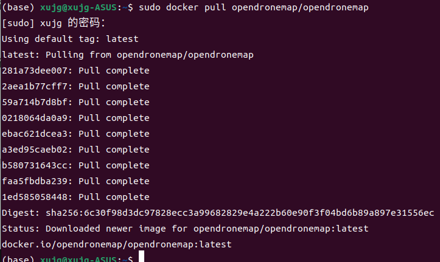

# OpenDroneMap

OpenDroneMap (ODM) 是一个开源的软件项目，用于处理从无人机获取的图像数据，并生成高质量的地理空间信息产品。它可以被用于多种应用，包括农业、测量、环境监测、考古学等。以下是对 OpenDroneMap 的详细介绍：
### 主要功能

* 图像拼接（Orthophoto Generation）：
        ODM 能够将无人机拍摄的重叠图像拼接成高分辨率的正射影像（orthophoto），这是一种经过几何校正的图像，具有统一的尺度和真实的地理位置。

* 三维模型重建（3D Reconstruction）：
        该软件能够将二维图像转换为三维模型，包括点云、网格和纹理模型。这对于地形分析、建筑物测绘等应用非常有用。

* 数字表面模型（DSM）和数字高程模型（DEM）生成：
        ODM 可以生成 DSM 和 DEM，分别表示地表物体和地形的高程数据。

* 地理信息系统（GIS）集成：
        生成的数据可以轻松集成到各种 GIS 软件中，以进行进一步的分析和应用。

* 多光谱和热成像数据处理：
        除了可见光图像，ODM 还支持多光谱和热成像数据的处理，适用于农业和环境监测等领域。

此外， ODM支持跨平台，可以运行在多种操作系统上，包括 Linux、Windows 和 macOS，方便不同用户的使用需求，提供了自动化的图像处理工作流程，用户只需提供原始图像数据，软件将自动完成从图像拼接到三维建模的所有步骤。

ODM项目github地址：[https://github.com/OpenDroneMap/ODM](https://github.com/OpenDroneMap/ODM)
ODM项目文档：[https://docs.opendronemap.org/](https://docs.opendronemap.org/)


### 快速开始

使用docker运行ODM, 首先拉取镜像
```bash
sudo docker pull opendronemap/opendronemap
```


```bash
(base) xujg@xujg-ASUS:~$ sudo docker images
REPOSITORY                  TAG         IMAGE ID       CREATED       SIZE
ubuntu                      latest      ba6acccedd29   2 years ago   72.8MB
hello-world                 latest      feb5d9fea6a5   2 years ago   13.3kB
nvidia/cuda                 10.0-base   97cca2bac989   2 years ago   109MB
opendronemap/opendronemap   latest      8c89143494c7   5 years ago   3.04GB
```
示例数据集在： [ https://github.com/OpenDroneMap/odm_data ]( https://github.com/OpenDroneMap/odm_data )

例如pull aukerman数据集
在仓库根目录下运行以下命令：
```bash
sudo docker run -it --rm \
    -v "$(pwd)/images:/code/images" \
    -v "$(pwd)/odm_orthophoto:/code/odm_orthophoto" \
    -v "$(pwd)/odm_texturing:/code/odm_texturing" \
    opendronemap/opendronemap
```
### 输入数据
无人机拍摄的重叠图像。这些图像可以是普通的**可见光图像**、**多光谱图像**或**热成像图像**。图像应具有足够的重叠度，通常建议 60-80% 的前向重叠（沿飞行方向）和侧向重叠（垂直于飞行方向）。
### 输出数据
正射影像 (Orthophoto)：

    高分辨率、地理校正后的正射影像，通常以 GeoTIFF 格式存储。

三维模型 (3D Model)：

    包括点云（Point Cloud）、网格模型（Mesh）和纹理模型（Textured Model），通常以 .obj 或 .ply 格式存储。

数字表面模型 (DSM) 和 数字高程模型 (DEM)：

    表示地表和地形的高程数据，通常以 GeoTIFF 格式存储。

需要指出的是，

生成DSM和DEM
```bash
docker run -it --rm \
    -v $(pwd)/images:/datasets/code/images \
    -v $(pwd)/odm_output:/datasets/code/odm_output \
    opendronemap/opendronemap --dsm --dtm --dem-resolution 2.0
```