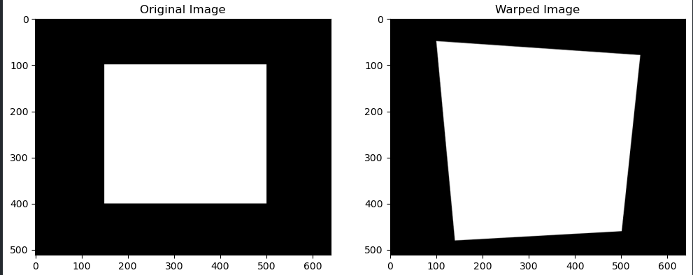

# 透射变换与重投影

### 透射变换

透射变换是指在2D图像中将一个平面变换到另一个平面的过程。这种变换可以通过一个3x3的矩阵来表示，适用于四个点的匹配。这种变换常用于图像配准、图像拼接等应用场景。透射变换可以处理旋转、缩放、平移以及透视变形。


透射变换可以表示为如下形式：

$\begin{pmatrix} x' \\ y' \\ w' \end{pmatrix} = \begin{pmatrix} h_{11} & h_{12} & h_{13} \\ h_{21} & h_{22} & h_{23} \\ h_{31} & h_{32} & h_{33} \end{pmatrix} \begin{pmatrix} x \\ y \\ 1 \end{pmatrix}$

其中：

-   $(x, y)$ 是原图像中的点。
-   $(x', y')$ 是目标图像中的点。
-   $H$ 是 3x3 的透射变换矩阵，包含9个参数 $h_{ij}$。
-   $w'$ 是一个归一化因子。

为了得到最终的图像坐标 $(x', y')$，需要进行归一化：

$x' = \frac{h_{11}x + h_{12}y + h_{13}}{h_{31}x + h_{32}y + h_{33}}$ ，$y' = \frac{h_{21}x + h_{22}y + h_{23}}{h_{31}x + h_{32}y + h_{33}}$

#### 求解透射变换矩阵

为了计算透射变换矩阵 $H$，我们需要至少四对对应点 $(x_i, y_i)$ 和 $(x'_i, y'_i)$，然后通过这些点来求解 $H$。下面是求解 $H$ 的步骤：

1.  **构建线性方程组**： 对于每一对点 $(x_i, y_i)$ 和 $(x'_i, y'_i)$，可以得到两个线性方程：
    
    $\begin{cases} h_{11}x_i + h_{12}y_i + h_{13} - h_{31}x_ix'_i - h_{32}y_ix'_i - h_{33}x'_i = 0 \\ h_{21}x_i + h_{22}y_i + h_{23} - h_{31}x_iy'_i - h_{32}y_iy'_i - h_{33}y'_i = 0 \end{cases}$
2.  **构建矩阵方程**： 将上面的方程组转换为矩阵形式 $A\vec{h} = 0$，其中 $A$ 是 2n x 9 的矩阵，$\vec{h}$ 是包含 $h_{ij}$ 的列向量：
    
    $A = \begin{pmatrix} x_1 & y_1 & 1 & 0 & 0 & 0 & -x_1x'_1 & -y_1x'_1 & -x'_1 \\ 0 & 0 & 0 & x_1 & y_1 & 1 & -x_1y'_1 & -y_1y'_1 & -y'_1 \\ \vdots & \vdots & \vdots & \vdots & \vdots & \vdots & \vdots & \vdots & \vdots \\ x_n & y_n & 1 & 0 & 0 & 0 & -x_nx'_n & -y_nx'_n & -x'_n \\ 0 & 0 & 0 & x_n & y_n & 1 & -x_ny'_n & -y_ny'_n & -y'_n \end{pmatrix}$
3.  **求解方程**： 使用奇异值分解（SVD）求解 $A\vec{h} = 0$ 的最小二乘解。


以下面代码举例
```python
import cv2
import numpy as np
import matplotlib.pyplot as plt

# 生成一个示例图像 (640x512)，可以替换为实际图像读取
image = np.zeros((512, 640, 3), dtype=np.uint8)
cv2.rectangle(image, (150, 100), (500, 400), (255, 255, 255), -1)  # 画一个白色矩形

# 定义原图像中的四个点（例如，矩形的四个角）
pts_src = np.array([[150, 100], [500, 100], [500, 400], [150, 400]])

# 定义目标图像中的四个点（将矩形变形为任意四边形）
pts_dst = np.array([[100, 50], [540, 80], [500, 460], [140, 480]])

# 计算透射变换矩阵
h, status = cv2.findHomography(pts_src, pts_dst)

# 使用透射变换矩阵对图像进行变换
im_out = cv2.warpPerspective(image, h, (640, 512))

# 显示原图像和变换后的图像
plt.figure(figsize=(12, 6))
plt.subplot(121)
plt.imshow(cv2.cvtColor(image, cv2.COLOR_BGR2RGB))
plt.title('Original Image')

plt.subplot(122)
plt.imshow(cv2.cvtColor(im_out, cv2.COLOR_BGR2RGB))
plt.title('Warped Image')

plt.show()

```





### 重投影

重投影则是指将三维点通过投影矩阵投影到二维图像平面上。重投影误差常用来评估三维重建或相机校准的精度，计算方式是将3D点投影到图像平面上，然后与实际图像点进行比较。


#### 重投影的数学公式

重投影可以通过以下步骤实现：

1.  **从三维点到二维点的投影**：

$\begin{pmatrix} u \\ v \\ 1 \end{pmatrix} = \begin{pmatrix} f_x & 0 & c_x \\ 0 & f_y & c_y \\ 0 & 0 & 1 \end{pmatrix} \begin{pmatrix} X / Z \\ Y / Z \\ 1 \end{pmatrix}$

其中：

-   $(X, Y, Z)$ 是三维点的坐标。
-   $(u, v)$ 是投影到图像平面上的二维点坐标。
-   $f_x$ 和 $f_y$ 是焦距。
-   $(c_x, c_y)$ 是图像的主点（光学中心）。

2.  **归一化**：

为了得到最终的图像坐标 $(u, v)$，需要进行归一化：

$u = \frac{X \cdot f_x}{Z} + c_x$ ，$v = \frac{Y \cdot f_y}{Z} + c_y$

### 计算重投影误差

重投影误差是衡量模型精度的一个指标，计算方法是将三维点通过相机投影矩阵投影到二维图像平面，然后与实际的二维图像点进行比较：

$\text{error} = \sqrt{(u - u')^2 + (v - v')^2}$

其中：

-   $(u, v)$ 是实际图像中的二维点。
-   $(u', v')$ 是通过重投影计算得到的二维点。

#### 1. 相机投影矩阵计算
相机投影矩阵 𝑃是通过相机内参矩阵 𝐾和外参（旋转矩阵𝑅和平移向量 𝑡计算得到的。


##### 相机内参矩阵 

\[ K = \begin{pmatrix}
    f_x & 0 & c_x \\
0 & f_y & c_y \\
0 & 0 & 1
\end{pmatrix} \]
##### 旋转矩阵 \( R \):
旋转矩阵 \( R \) 是由三个旋转矩阵（绕 Z 轴的偏航角 \( \theta_z \)，绕 Y 轴的俯仰角 \( \theta_y \)，绕 X 轴的滚转角 \( \theta_x \)）组成的：  

\[ R = R_z(\theta_z) \cdot R_y(\theta_y) \cdot R_x(\theta_x) \]  

其中：  

\[ R_z(\theta_z) = \begin{pmatrix}
\cos(\theta_z) & -\sin(\theta_z) & 0 \\
\sin(\theta_z) & \cos(\theta_z) & 0 \\
0 & 0 & 1
\end{pmatrix} \]  

\[ R_y(\theta_y) = \begin{pmatrix}
\cos(\theta_y) & 0 & \sin(\theta_y) \\
0 & 1 & 0 \\
-\sin(\theta_y) & 0 & \cos(\theta_y)
\end{pmatrix} \]  

\[ R_x(\theta_x) = \begin{pmatrix}
1 & 0 & 0 \\
0 & \cos(\theta_x) & -\sin(\theta_x) \\
0 & \sin(\theta_x) & \cos(\theta_x)
\end{pmatrix} \]  

##### 平移向量 \( t \):  

\[ t = \begin{pmatrix}
t_x \\
t_y \\
t_z
\end{pmatrix} \]  

##### 投影矩阵 \( P \):  

\[ P = K \cdot [R | t] \]  

#### 2. 图像坐标到地面坐标的转换  

对于每个图像像素坐标 \( (u, v) \)，可以计算其在世界坐标系中的三维点 \( (X, Y, Z) \)：  

\[ \begin{pmatrix}
X \\
Y \\
Z \\
1
\end{pmatrix} = P_{\text{inv}} \cdot \begin{pmatrix}
u \\
v \\
1
\end{pmatrix} \]  

其中 \( P_{\text{inv}} \) 是投影矩阵的伪逆矩阵。
#### 3. 使用地面高程进行归一化
假设地面高程为 \( Z = H \)，则：  

\[ \begin{pmatrix}
X' \\
Y' \\
H \\
1
\end{pmatrix} = \frac{H}{Z} \cdot \begin{pmatrix}
X \\
Y \\
Z \\
1
\end{pmatrix} \]

#### 4. 地面坐标映射到正射图像  

将地面坐标 \( (X', Y') \) 映射到正射图像坐标 \( (u', v') \)：  

\[ u' = \frac{X'}{\Delta X} + u_0 \]  

\[ v' = \frac{Y'}{\Delta Y} + v_0 \]  

其中 \( \Delta X \) 和 \( \Delta Y \) 是地面坐标到像素坐标的比例因子，\( (u_0, v_0) \) 是正射图像的中心坐标。