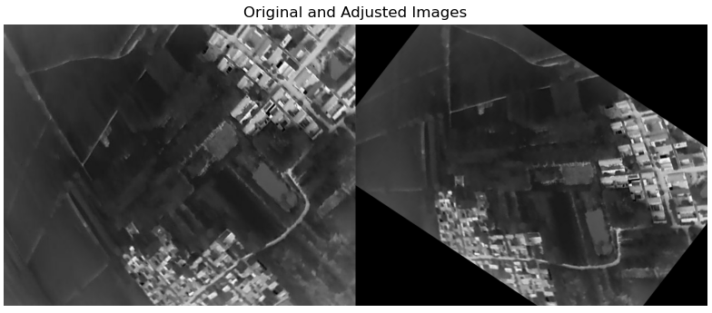
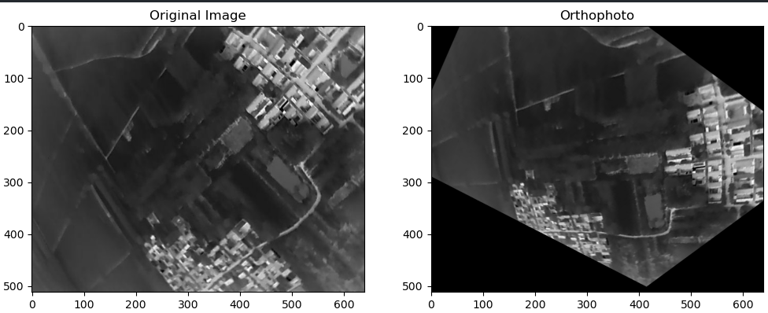

# 倾斜图像变换正射图像

### 方法一

1.  **计算旋转矩阵** 根据俯仰角(pitch)，偏航角(yaw)，滚转角(roll)计算旋转矩阵。
    
2.  **定义原图像中的四个点** 定义图像四个角点的坐标，如 $(0, 0)$、$(width-1, 0)$、$(width-1, height-1)$ 和 $(0, height-1)$。
    
3.  **计算目标图像的四个点** 通过旋转矩阵计算目标图像的四个点。
    
    -   将源点坐标中心化（可以考虑相机内参的影响），应用旋转矩阵，再恢复到原始位置。
    -   由于点是2D点，不使用旋转矩阵的最后一列。
4.  **计算透射矩阵** 使用 `cv2.getPerspectiveTransform` 通过原图像和目标图像的四个点计算透射矩阵。
    
5.  **应用透射矩阵** 使用 `cv2.warpPerspective` 将透射矩阵应用到原图像，以得到目标图像。

代码示例：
```python
import cv2
import numpy as np
from matplotlib import pyplot as plt


camera_parameters = {
    "width": 640,
    "height": 512,
    "focal_x": 0.8645801943826472,
    "focal_y": 0.8645801943826472,
    "c_x": -0.005689562165298415,
    "c_y": -0.0037807145404085553,
    "k1": -0.2967016615133813,
    "k2": 0.08663139457756042,
    "p1": 0.0008407777901525121,
    "p2": 8.959107030007158e-05,
    "k3": 0.023342862058067047
}

K = np.array([[camera_parameters["focal_x"] * camera_parameters["width"], 0, (camera_parameters["c_x"] + 0.5) * camera_parameters["width"]],
              [0, camera_parameters["focal_y"] * camera_parameters["height"], (camera_parameters["c_y"] + 0.5) * camera_parameters["height"]],
              [0, 0, 1]])


def euler_to_rotation_matrix(roll, pitch, yaw):
    """
    Convert Euler angles to a rotation matrix.
    """
    R_x = np.array([[1, 0, 0],
                    [0, np.cos(roll), -np.sin(roll)],
                    [0, np.sin(roll), np.cos(roll)]])
    
    R_y = np.array([[np.cos(pitch), 0, np.sin(pitch)],
                    [0, 1, 0],
                    [-np.sin(pitch), 0, np.cos(pitch)]])
    
    R_z = np.array([[np.cos(yaw), -np.sin(yaw), 0],
                    [np.sin(yaw), np.cos(yaw), 0],
                    [0, 0, 1]])
    
    R = np.dot(R_z, np.dot(R_y, R_x))
    return R


def adjust_image(image_path, roll, pitch, yaw):
    """
    Adjust the image to orthographic view using the given roll, pitch, and yaw angles.
    """
    # Read the image
    image = cv2.imread(image_path)
    
    # Image dimensions
    height, width = image.shape[:2]
    
    # Get the rotation matrix
    R = euler_to_rotation_matrix(roll, pitch, yaw)
    
    # Define the source points (four corners of the image)
    src_points = np.array([[0, 0],
                           [width - 1, 0],
                           [width - 1, height - 1],
                           [0, height - 1]], dtype='float32')
    
    # Apply the rotation to the source points
    centered_src_points = src_points - np.array([K[0][2], K[1][2]])

    # Apply the rotation to the centered points
    rotated_points = np.dot(centered_src_points, R[:2, :2].T)

    # Restore the points back to the original image coordinates
    dst_points = rotated_points + np.array([K[0][2], K[1][2]])
    dst_points = dst_points.astype('float32')

    # 计算透视变换矩阵
    matrix = cv2.getPerspectiveTransform(src_points, dst_points)

    
    # Apply the perspective transformation
    adjusted_image = cv2.warpPerspective(image, matrix, (width, height))
    
    return adjusted_image

# Example usage
image_path = '@437100@4221736@0.585299@-0.101259@0.638664@374.0050048828@37275@.jpg'
yaw, pitch, roll = np.float32(image_path.split("@")[3]), np.float32(image_path.split("@")[4]), np.float32(image_path.split("@")[5])
adjusted_image = adjust_image(image_path, roll, pitch, yaw)

# Read the original image
original_image = cv2.imread(image_path)

# Concatenate the original and adjusted images horizontally
concatenated_image = np.concatenate((original_image, adjusted_image), axis=1)

# Convert the image from BGR to RGB for displaying using matplotlib
concatenated_image_rgb = cv2.cvtColor(concatenated_image, cv2.COLOR_BGR2RGB)

# Display the concatenated image
plt.figure(figsize=(10, 5))
plt.imshow(concatenated_image_rgb)
plt.axis('off')
plt.title('Original and Adjusted Images')
plt.show()


```



### 方法二

1.  **计算旋转矩阵** 根据俯仰角(pitch)，偏航角(yaw)，滚转角(roll)计算旋转矩阵。
    
2.  **计算透射变换矩阵** 计算透射变换矩阵   
   `H = np.dot(A2, np.dot(T, np.dot(R, A1)))`。
    
    -   `A1`：2D 到 3D 投影矩阵。
    -   `RX`, `RY`, `RZ`：分别绕 X、Y、Z 轴的旋转矩阵。
    -   `R`：组合的旋转矩阵。
    -   `T`：平移矩阵。
    -   `A2`：3D 到 2D 投影矩阵。
3.  **应用透射矩阵** 使用 `cv2.warpPerspective` 将透射矩阵应用到原图像，以得到目标图像。
    
```python
import numpy as np
import cv2
import matplotlib.pyplot as plt

# Reference:
#     1.        : http://stackoverflow.com/questions/17087446/how-to-calculate-perspective-transform-for-opencv-from-rotation-angles
#     2.        : http://jepsonsblog.blogspot.tw/2012/11/rotation-in-3d-using-opencvs.html


camera_parameters = {
    "width": 640,
    "height": 512,
    "focal_x": 0.8645801943826472,
    "focal_y": 0.8645801943826472,
    "c_x": -0.005689562165298415,
    "c_y": -0.0037807145404085553,
    "k1": -0.2967016615133813,
    "k2": 0.08663139457756042,
    "p1": 0.0008407777901525121,
    "p2": 8.959107030007158e-05,
    "k3": 0.023342862058067047
}

class ImageTransformer(object):
    """ Perspective transformation class for image
        with shape (height, width, #channels) """

    def __init__(self, image_path, shape = None):
        self.image_path = image_path
        self.image = cv2.imread(image_path)
 
        self.height = self.image.shape[0]
        self.width = self.image.shape[1]
        self.num_channels = self.image.shape[2]


    """ Wrapper of Rotating a Image """
    def rotate_along_axis(self, rtheta=0, rphi=0, rgamma=0, dx=0, dy=0, dz=0):
        
        # Get ideal focal length on z axis
        # NOTE: Change this section to other axis if needed
        d = np.sqrt(self.height**2 + self.width**2)
        self.focal = d / (2 * np.sin(rgamma) if np.sin(rgamma) != 0 else 1)
        dz = self.focal

        # Get projection matrix
        mat = self.get_M(rtheta, rphi, rgamma, dx, dy, dz)
        
        return cv2.warpPerspective(self.image.copy(), mat, (self.width, self.height))


    """ Get Perspective Projection Matrix """
    def get_M(self, theta, phi, gamma, dx, dy, dz):
        
        w = self.width
        h = self.height
        f = self.focal

        c_x = (camera_parameters["c_x"] + 0.5) * camera_parameters["width"]
        c_y = (camera_parameters["c_y"] + 0.5) * camera_parameters["height"]
        f_x = camera_parameters["focal_x"] * camera_parameters["width"]
        f_y = camera_parameters["focal_y"] * camera_parameters["height"]

        # Projection 2D -> 3D matrix
        A1 = np.array([ [1, 0, -c_x],
                        [0, 1, -c_y],
                        [0, 0, 1],
                        [0, 0, 1]])
        
        # Rotation matrices around the X, Y, and Z axis
        RX = np.array([ [1, 0, 0, 0],
                        [0, np.cos(theta), -np.sin(theta), 0],
                        [0, np.sin(theta), np.cos(theta), 0],
                        [0, 0, 0, 1]])
        
        RY = np.array([ [np.cos(phi), 0, -np.sin(phi), 0],
                        [0, 1, 0, 0],
                        [np.sin(phi), 0, np.cos(phi), 0],
                        [0, 0, 0, 1]])
        
        RZ = np.array([ [np.cos(gamma), -np.sin(gamma), 0, 0],
                        [np.sin(gamma), np.cos(gamma), 0, 0],
                        [0, 0, 1, 0],
                        [0, 0, 0, 1]])

        # Composed rotation matrix with (RX, RY, RZ)
        R = np.dot(np.dot(RX, RY), RZ)

        T = np.array([  [1, 0, 0, dx],
                [0, 1, 0, dy],
                [0, 0, 1, dz],
                [0, 0, 0, 1]])
        # Projection 3D -> 2D matrix
        A2 = np.array([ [f, 0, c_x, 0],
                        [0, f, c_y, 0],
                        [0, 0, 1, 0]])

        # Final transformation matrix
        return np.dot(A2, np.dot(T, np.dot(R, A1)))
    
img_path = '@437100@4221736@0.585299@-0.101259@0.638664@374.0050048828@37275@.jpg'
image = cv2.imread(img_path)
yaw, pitch, roll = np.float32(img_path.split("@")[3]), np.float32(img_path.split("@")[4]), np.float32(img_path.split("@")[5])

it = ImageTransformer(img_path)
rotated_img = it.rotate_along_axis(rtheta=roll, rphi=pitch, rgamma=yaw)
plt.figure(figsize=(12, 6))
plt.subplot(121)
plt.imshow(cv2.cvtColor(image, cv2.COLOR_BGR2RGB))
plt.title('Original Image')

plt.subplot(122)
plt.imshow(cv2.cvtColor(rotated_img, cv2.COLOR_BGR2RGB))
plt.title('Orthophoto')

plt.show()

```

