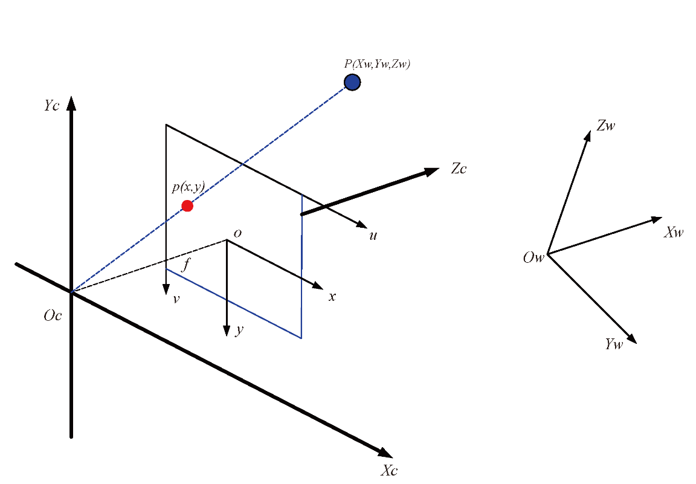
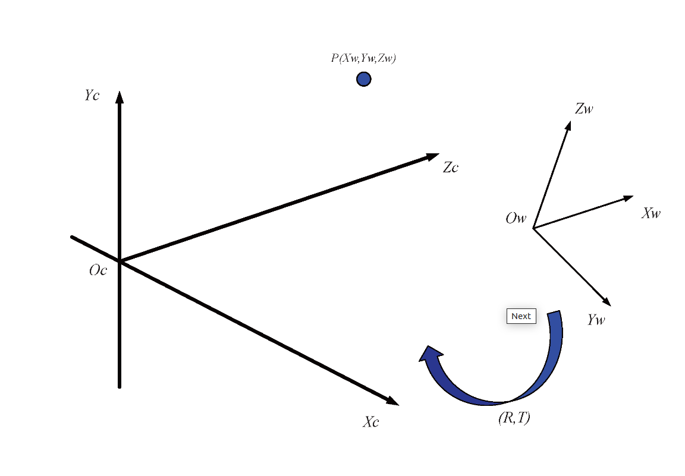
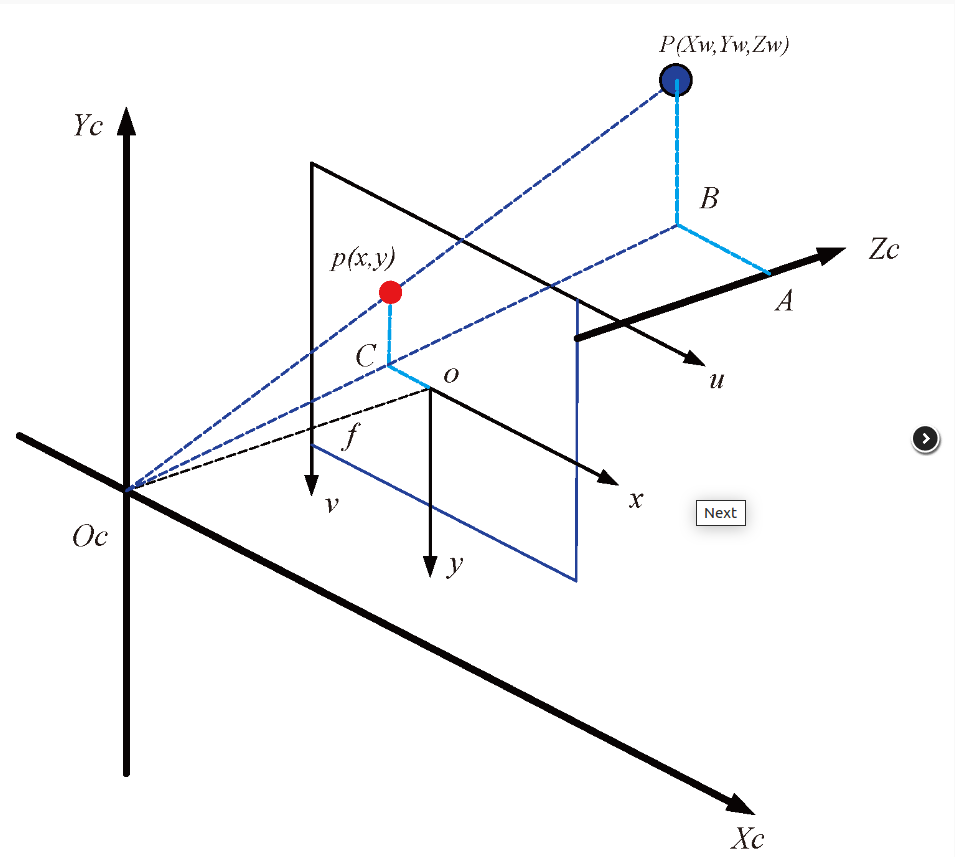
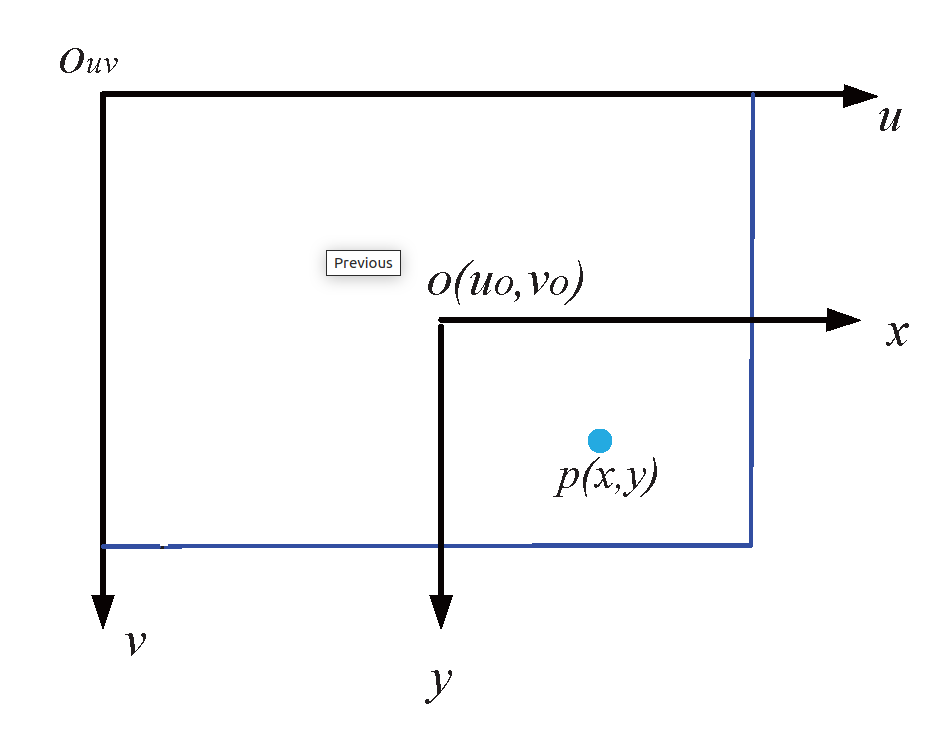

# 图像坐标系之间的关系

### 世界、相机、图像和像素坐标之间的转换

#### 四个坐标之间的几何关系

图像处理中涉及到以下四个坐标系：
* $O_w - X_wY_wZ_w$ : 世界坐标系， 描述相机位置， 单位： m
* $O_c - X_cY_cZ_c$: 相机坐标系， 光心为原点，单位： m
* $O_{xy}$: 图像坐标系，光心为图像中点，单位： mm
* $uv$: 像素坐标系，原点为图像左上角，单位: pixel
* $P$: 世界坐标系中的一点，即为生活中真实的一点；
* $p$: 点P在图像中的成像点，在图像坐标系中的坐标为$(x, y)$, 在像素坐标系中的坐标为$(u, v)$
* $f$：相机焦距，等于$o$与$O_c$的距离，$f = ||o - O_c||$

#### 世界坐标系和相机坐标系之间的转换

从世界坐标系变换到相机坐标系属于刚体变换： 即物体不会发生形变，只需要进行旋转和平移。
$R$: 表示旋转矩阵
$T$: 表示平移矩阵；

$\left[\begin{array}{c}X_c \\ Y_c \\ Z_c\end{array}\right]=R\left[\begin{array}{l}X_w \\ Y_w \\ Z_w\end{array}\right]+T$

以齐次坐标表示：
$\left[\begin{array}{c}X_c \\ Y_c \\ Z_c \\ 1\end{array}\right]=\left[\begin{array}{cc}R_{3 \times 3} & T_{3 \times 1} \\ 0 & 1\end{array}\right]\left[\begin{array}{c}X_w \\ Y_w \\ Z_w \\ 1\end{array}\right]$

#### 相机坐标系到图像坐标系之间的转换

从相机坐标系到图像坐标系是从3D转换到2D, 属于透视投影关系，以下是推导过程：

$$
\begin{aligned}
& \triangle A B O_c \sim \triangle o C O_c \\
& \triangle P B O_c \sim \triangle p C O_c
\end{aligned}
$$

$$
\begin{gathered}
\frac{A B}{o C}=\frac{A O_c}{o O_c}=\frac{P B}{p C}=\frac{X_c}{x}=\frac{Z_c}{f}=\frac{Y_c}{y} \\
x=f \frac{X_c}{Z_c}, y=f\frac{Y_c}{Z_c} \\
Z_c\left[\begin{array}{l}
x \\
y \\
1
\end{array}\right]=\left[\begin{array}{llll}
f & 0 & 0 & 0 \\
0 & f & 0 & 0 \\
0 & 0 & 1 & 0
\end{array}\right]\left[\begin{array}{c}
X_c \\
Y_c \\
Z_c \\
1
\end{array}\right]
\end{gathered}
$$

很明显，$Z_c$是空间点$P$的深度信息。此时，投影点$p$的单位还是mm， 并不是像素pixel,需要进一步转换到像素坐标系。

#### 图像坐标系到像素坐标系之间的转换

像素坐标系和图像坐标系都在成像平面上，只是各自的原点和度量单位不一样。图像坐标系的原点为相机光轴与成像平面的交点，通常情况下是成像平面饿中点或者角pricipal point。图像坐标系的单位是mm, 是物理单位，而像素坐标系的单位Pixel， 我们平常描述一个像素点都是几行几列。所以这两者之间的转换关系如下:

$\begin{aligned} & u=\frac{x}{d x}+u_0 \\ & v=\frac{y}{d y}+v_0\end{aligned}$

其中，$dx$和$dy$分别表示每一列和每一行分别代表了多少mm,即1 pixel=dx mm

以齐次坐标形式表示为：

$$
\left[\begin{array}{c}
u \\
v \\
1
\end{array}\right]=\left[\begin{array}{ccc}
\frac{1}{d x} & 0 & u_0 \\
0 & \frac{1}{d y} & v_0 \\
0 & 0 & 1
\end{array}\right]\left[\begin{array}{c}
x \\
y \\
1
\end{array}\right]
$$

最后总结为：
$$
\begin{aligned}
Z_c\left[\begin{array}{c}
u \\
v \\
1
\end{array}\right] & =\left[\begin{array}{ccc}
\frac{1}{d x} & 0 & u_0 \\
0 & \frac{1}{d y} & v_0 \\
0 & 0 & 1
\end{array}\right]\left[\begin{array}{cccc}
f & 0 & 0 & 0 \\
0 & f & 0 & 0 \\
0 & 0 & 1 & 0
\end{array}\right]\left[\begin{array}{cc}
R_{3 \times 3} & T_{3 \times 1} \\
0 & 1
\end{array}\right]\left[\begin{array}{c}
X_w \\
Y_w \\
Z_w \\
1
\end{array}\right] \\
& =\left[\begin{array}{cccc}
f_x & 0 & u_0 & 0 \\
0 & f_y & v_0 & 0 \\
0 & 0 & 1 & 0
\end{array}\right]\left[\begin{array}{cc}
R_{3 \times 3} & T_{3 \times 1} \\
0 & 1
\end{array}\right]\left[\begin{array}{c}
X_w \\
Y_w \\
Z_w \\
1
\end{array}\right]
\end{aligned}
$$
前者为相机内参， 后者为相机外参

$Z_c$是深度信息，空间中的一个坐标点，可以在图像中找到一个对应的像素点，但是，通过图像中的一个点找到它在空间中对应的点很难，因为$Z_c$s深度信息未知。

## exp

>已知无人机的姿态，相机的安装角度， 相机内参和图像上一点及对应的世界坐标，推导它们之间的关系

### 像素坐标系到相机坐标系

通过相机内参$K$和图像坐标$(u, v)$， 可以得到相机坐标系中的点$P_{cam}$， 但需要知道该点的深度$s$， 这个过程的公式是：
$\mathbf{P}_{cam} = K^{-1} \begin{bmatrix} u \\ v \\ 1 \end{bmatrix} \cdot s$

### 相机坐标转换到无人机坐标

给定相机的安装角度 $\mathbf{R}_{camera}$​，相机坐标系中的点 $\mathbf{P}_{cam}$​ 可以转换到无人机坐标系(忽略平移)。因此转换公式为：

$\mathbf{P}_{drone} = \mathbf{R}_{camera}^{T} \mathbf{P}_{cam}$

这里的 $\mathbf{P}_{drone}$ 是相机坐标系对应的点在无人机坐标系下的表示。

### 无人机坐标到世界坐标系

给定相无人机的姿态$\mathbf{R}_{drone}$​，无人机坐标系中的点 $\mathbf{P}_{drone}$​ 可以转换到世界坐标系（忽略平移）。因此转换公式为：

$\mathbf{P}_{golbal} = \mathbf{R}_{drone}^{T} \mathbf{P}_{drone}$

这里的 $\mathbf{P}_{global}$ 是无人机坐标系对应的点在世界坐标系下的表示。

