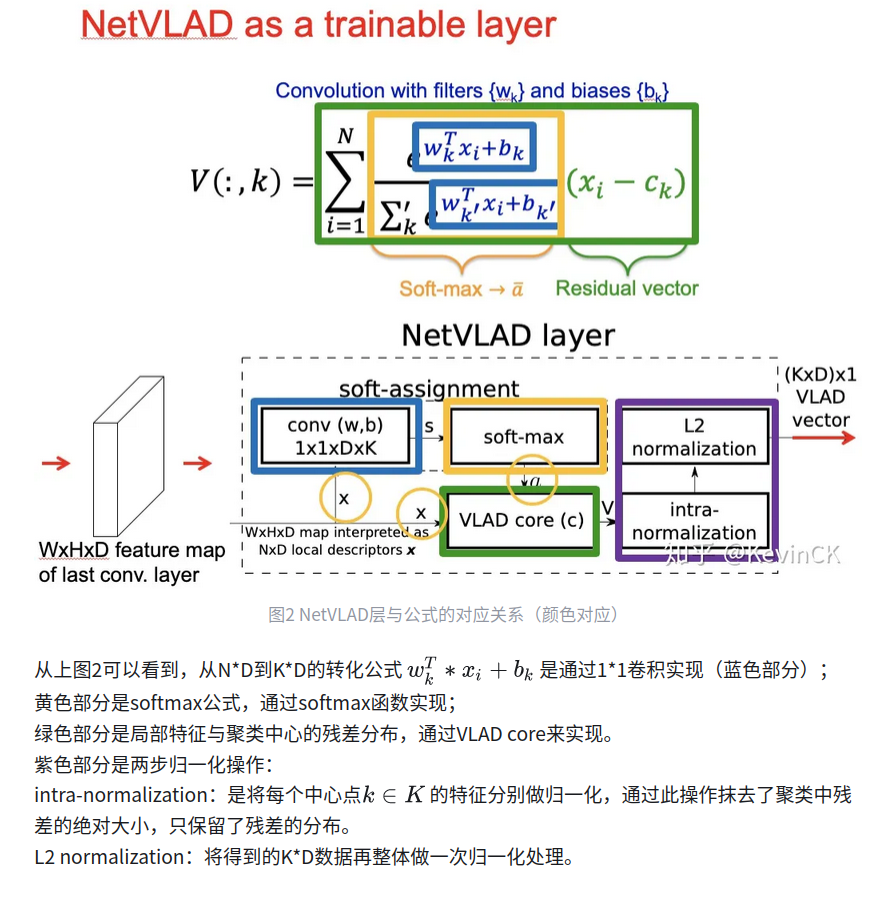

# NetVLAD向量聚合

## 1. VLAD
VLAD 是一种传统的局部特征聚合方法，用于将一个图像中大量的局部特征（如 SIFT、SURF）编码为一个定长的向量，方便图像检索和匹配
VLAD 同时考虑了 **描述子的分布偏移（残差）**，因而更有判别性。


### 1.1 VLAD 的主要步骤：

假设有一张图像，提取了一组局部特征（如 128 维的 SIFT 特征）

#### 1.1.1 **建立视觉词典（codebook）**

* 使用 KMeans 对所有训练图像中的局部特征聚类，得到 K 个聚类中心 $\{c_1, c_2, ..., c_K\}$
* 这些聚类中心就像是“视觉单词”或“anchor”

#### 1.1.2 **对每个局部特征进行分配**

* 对每个局部描述子 $x_i$，找到最近的聚类中心 $c_k$（**hard assignment**）

#### 1.1.3 **计算残差向量**

* 计算描述子与其聚类中心之间的残差 $x_i - c_k$

#### 1.1.4 **对残差进行聚合**

* 对所有属于同一聚类中心的残差向量求和：

$$
v_k = \sum_{x_i \in c_k} (x_i - c_k)
$$

#### 1.1.5 **连接所有残差向量**

* 把所有聚类中心的聚合残差 $v_k$ 拼接在一起，形成最终的 VLAD 特征向量：

$$
VLAD = [v_1, v_2, ..., v_K]
$$

#### 1.1.6 **后处理**

* L2 normalization、power normalization（例如 signed square root）常用于提升效果


### 1.2 VLAD特征维度计算：

假设：

* 每个局部特征是 D 维（如 SIFT 是 128D）
* 聚类中心数是 K（如 64）

则：

$$
\text{VLAD 向量维度} = K \times D
$$


### 1.3 优点

| 优点                     | 描述                    |
| ---------------------- | --------------------- |
| ✅ 比 BoW 更有表现力          | 不只是统计数量，而是捕捉了描述子的分布信息 |
| ✅ 紧凑表示                 | 可被 PCA 或降维处理          |
| ✅ 可与 SIFT/SURF/HOG 等结合 | 不依赖 CNN，可在传统图像处理中使用   |


### 1.4 缺点

| 缺点            | 描述                              |
| ------------- | ------------------------------- |
| ❌ 不是端到端       | 聚类与特征提取分离，不能训练优化                |
| ❌ 不适合深度特征     | 在深度学习中不易直接使用                    |
| ❌ 硬分配可能导致信息丢失 | 改进为 soft-assignment 后变为 NetVLAD |

## 2. NetVLAD
NetVLAD 是一种将 CNN 局部特征聚合为全局描述符的可训练模块，广泛应用于图像检索和视觉定位任务。


### 2.1 NetVLAD 的结构组成

输入通常是一张图像，经过 CNN（如 ResNet）得到一个特征图：

```
输入特征图大小： B x C x H x W
```

NetVLAD 会对这组特征做以下处理：

#### 2.1.1. Soft assignment 软分配

对每个特征点 $x_i \in \mathbb{R}^D$，计算它属于每个 cluster 的概率：

$$
a_k(x_i) = \frac{e^{w_k^\top x_i + b_k}}{\sum_{j=1}^{K} e^{w_j^\top x_i + b_j}}
$$

这一步相当于可训练的 soft-KMeans，用 1x1 卷积实现

#### 2.1.2 残差编码

对每个特征点和中心 $c_k$ 计算残差：

$$
r_{ik} = a_k(x_i) \cdot (x_i - c_k)
$$

然后在每个 cluster 上做求和聚合：

$$
V_k = \sum_i r_{ik}
$$

得到聚合后每个 cluster 的残差信息。

#### 2.1.3 拼接输出向量

所有 cluster 的残差向量拼接成一个大向量 $V = [V_1, V_2, ..., V_K]$，其维度为：

$$
\text{维度} = K \times D
$$


### 2.2 代码示例

   

```python
import torch
import torch.nn as nn
import torch.nn.functional as F

class NetVLAD(nn.Module):
"""NetVLAD layer implementation"""
  
    def __init__(self, num_clusters=64, dim=16, alpha=100.0,normalize_input=True):

    """
    Args:
    num_clusters : int
    The number of clusters
    dim : int
    Dimension of descriptors
    alpha : float
    Parameter of initialization. Larger value is harder assignment.
    normalize_input : bool
    If true, descriptor-wise L2 normalization is applied to input.
    """

    super(NetVLAD, self).__init__()
    self.num_clusters = num_clusters
    self.dim = dim
    self.alpha = alpha
    self.normalize_input = normalize_input
    self.conv = nn.Conv2d(dim, num_clusters, kernel_size=(1, 1), bias=True)
    self.centroids = nn.Parameter(torch.rand(num_clusters, dim))
    self._init_params()

    def _init_params(self):

    self.conv.weight = nn.Parameter((2.0 * self.alpha * self.centroids).unsqueeze(-1).unsqueeze(-1))
    self.conv.bias = nn.Parameter(- self.alpha * self.centroids.norm(dim=1))

    def forward(self, x):

    N, C = x.shape[:2]
    if self.normalize_input:
        x = F.normalize(x, p=2, dim=1) # across descriptor dim

    # soft-assignment
    # x: [48, 16, 32, 32] -> [48, 64, 32, 32] -> [48, 64, 1024]
    soft_assign = self.conv(x).view(N, self.num_clusters, -1)
    soft_assign = F.softmax(soft_assign, dim=1)

    # x: [48, 16, 32, 32] -> [48, 16, 1024]
    x_flatten = x.view(N, C, -1)

    # calculate residuals to each clusters
    # x_flatten:[48, 16, 1024] -> [48, 64, 16, 1024]
    # centroids: [64, 16] -> [1024, 64, 16] -> [64, 16, 1024] -> [1, 64, 16, 1024]
    residual = x_flatten.expand(self.num_clusters, -1, -1, -1).permute(1, 0, 2, 3) - self.centroids.expand(x_flatten.size(-1), -1, -1).permute(1, 2, 0).unsqueeze(0)

    residual *= soft_assign.unsqueeze(2)
    vlad = residual.sum(dim=-1)
    vlad = F.normalize(vlad, p=2, dim=2) # intra-normalization
    vlad = vlad.view(x.size(0), -1) # flatten
    vlad = F.normalize(vlad, p=2, dim=1) # L2 normalize

    return vlad

  

if __name__ == "__main__":

    net = NetVLAD()
    input = torch.randn((48, 16, 32, 32))
    output = net(input)
    print(output.shape)
```

### 2.2 训练方式

NetVLAD 一般在 **图像检索或定位任务中**使用以下方式训练：

* 🔹 **Triplet Loss / Contrastive Loss**：匹配正负图像对，让描述子对同一地点更接近。
* 🔹 **ProxyNCA / ArcFace**：更复杂的结构匹配训练。


### 2.3 输出维度示例：

* CNN 输出 shape = `[B, 512, 20, 20]` → 展开为 `400` 个 `512D` 特征
* 聚类数 $K = 64$

那么 NetVLAD 输出维度：

$$
\text{Output dim} = 64 \times 512 = 32768
$$

一般会加：

* BatchNorm / L2 Normalization
* PCA + Whitening（压缩到比如 4096 或 2048 维）


## 🤝 与 NetVLAD 区别对比

| 比较点  | VLAD            | NetVLAD         |
| ---- | --------------- | --------------- |
| 聚类方式 | KMeans，离线       | 可学习，端到端训练       |
| 分配方式 | Hard assignment | Soft assignment |
| 可训练性 | 否               | 是（可微）           |
| 特征输入 | 手工局部特征（如 SIFT）  | CNN 输出的特征图      |
| 应用场景 | 传统图像检索          | 深度学习图像定位/检索     |

## 📘 参考论文

* **VLAD: Aggregating Local Descriptors for Large-Scale Image Search** H. Jégou et al., CVPR 2010
* **NetVLAD: CNN architecture for weakly supervised place recognition** Relja Arandjelovic, et al. – CVPR 2016