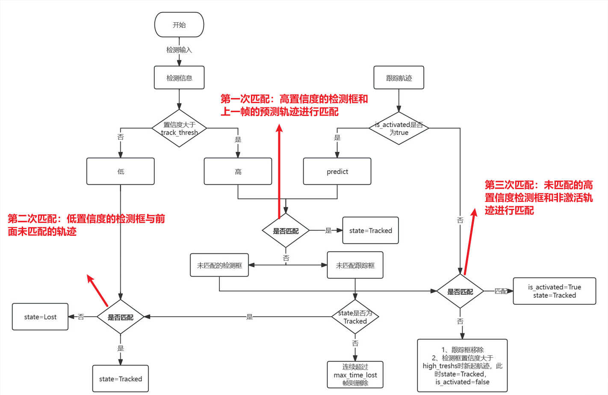
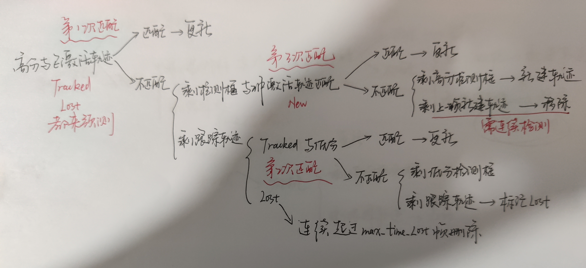

# ByteTrack跟踪算法

ByteTrack（[BoT-SORT’s predecessor]）是一种高性能的 **多目标跟踪（Multi-Object Tracking, MOT）** 算法

多目标追踪算法一般在完成当前帧的目标检测后只会保留置信度比较大的检测框用于进行目标跟踪，而在ByteTrack中，作者保留了所有的检测框并且通过阈值将它们分成了高置信度检测框和低置信度检测框。ByteTrack 可以有效解决一些遮挡，且能够保持较低的 ID Switch。因为目标会因为被遮挡检测置信度有所降低，当重新出现时，置信度会有所升高。算法特点在于：

当目标逐渐被遮挡时，跟踪目标与低置信度检测目标匹配。
当目标遮挡逐渐重现时，跟踪目标与高置信度检测目标匹配。

**相比与SORT**
bytetrack也是用到了卡尔曼滤波和匈牙利算法，不同的就是bytetrack利用了检测得到的高得分框和低得分框，匹配逻辑更复杂，而sort只用了最高得分的检测框去和历史轨迹做匹配，匹配逻辑简单点，但是不管是bytetrack还是sort都是用了匈牙利算法做匹配，只不过匹配的逻辑不太一样，并且两者都是用了卡尔曼滤波做预测以及更新最优值。






## 代码逻辑

### `STrack`
为每个目标框创建一个对象：表示单个目标的轨迹，包含卡尔曼滤波预测、状态更新等功能

#### (1) 初始化 `__init__()`
```python
def __init__(self, tlwh, score):
    self._tlwh = np.asarray(tlwh, dtype=np.float64)  # 目标的边界框 (x, y, w, h)
    self.kalman_filter = None  # 卡尔曼滤波器
    self.mean, self.covariance = None, None  # 目标状态均值 & 协方差
    self.is_activated = False  # 轨迹是否激活
    self.score = score  # 目标检测分数
    self.tracklet_len = 0  # 目标存在的帧数
```

📌 **作用**：创建一个目标跟踪对象，并存储其初始状态（位置、置信度分数等）。


#### **(2) 预测 `predict()`**

```python
def predict(self):
    mean_state = self.mean.copy()
    if self.state != TrackState.Tracked:
        mean_state[7] = 0  # 如果不是 Tracked 状态，速度设为 0
    self.mean, self.covariance = self.kalman_filter.predict(mean_state, self.covariance)
```

📌 **作用**：

- **基于卡尔曼滤波预测目标的下一帧位置**，如果目标状态不为 `Tracked`，则设速度为 0。


#### **(3) 多目标预测 `multi_predict()`**

```python
@staticmethod
def multi_predict(stracks):
    if len(stracks) > 0:
        multi_mean = np.asarray([st.mean.copy() for st in stracks])
        multi_covariance = np.asarray([st.covariance for st in stracks])
        for i, st in enumerate(stracks):
            if st.state != TrackState.Tracked:
                multi_mean[i][7] = 0  # 速度归零
        multi_mean, multi_covariance = STrack.shared_kalman.multi_predict(multi_mean, multi_covariance)
        for i, (mean, cov) in enumerate(zip(multi_mean, multi_covariance)):
            stracks[i].mean = mean
            stracks[i].covariance = cov
```

📌 **作用**：

- **对所有目标同时进行卡尔曼滤波预测**，提高效率。


#### **(4) 轨迹激活 `activate()`**

```python
def activate(self, kalman_filter, frame_id):
    self.kalman_filter = kalman_filter
    self.track_id = self.next_id()  # 轨迹 ID 递增
    self.mean, self.covariance = self.kalman_filter.initiate(self.tlwh_to_xyah(self._tlwh))
    self.state = TrackState.Tracked  # 设置状态为 Tracked
    if frame_id == 1:
        self.is_activated = True
    self.frame_id = frame_id
    self.start_frame = frame_id
```

📌 **作用**：

- 当检测到新的目标时，**初始化卡尔曼滤波器** 并 **分配新的 Track ID**。


#### **(5) 轨迹更新 `update()`**

```python
def update(self, new_track, frame_id):
    self.frame_id = frame_id
    self.tracklet_len += 1
    new_tlwh = new_track.tlwh
    self.mean, self.covariance = self.kalman_filter.update(
        self.mean, self.covariance, self.tlwh_to_xyah(new_tlwh))
    self.state = TrackState.Tracked
    self.is_activated = True
    self.score = new_track.score
```

📌 **作用**：

- 当一个新检测结果与当前轨迹匹配时，**更新轨迹状态**。


#### **(6) 轨迹重新激活 `re_activate()`**

```python
def re_activate(self, new_track, frame_id, new_id=False):
    self.mean, self.covariance = self.kalman_filter.update(
        self.mean, self.covariance, self.tlwh_to_xyah(new_track.tlwh)
    )
    self.is_activated = True
    self.frame_id = frame_id
    if new_id:
        self.track_id = self.next_id()
    self.score = new_track.score
```

📌 **作用**：

- **如果目标曾丢失但又被重新检测到，则重新激活**。

### `BYTETracker`

**`BYTETracker`**（主跟踪器）：管理所有目标的状态，包括检测、匹配、更新、轨迹管理等。

### **(1) 初始化 `__init__()`**

```python
def __init__(self, args, frame_rate=30):
    self.tracked_stracks = []  # 正在跟踪的轨迹
    self.lost_stracks = []  # 丢失的轨迹
    self.removed_stracks = []  # 删除的轨迹
    self.frame_id = 0  # 当前帧号
    self.args = args
    self.det_thresh = args.track_thresh + 0.1  # 目标检测阈值
    self.buffer_size = int(frame_rate / 30.0 * args.track_buffer)  # 轨迹缓冲区
    self.max_time_lost = self.buffer_size  # 允许丢失的最大帧数
    self.kalman_filter = KalmanFilter()
```

📌 **作用**：

- 初始化 BYTETracker 并设置跟踪参数（例如轨迹缓冲区大小）。

### **(2) 更新 `update()`**(算法核心逻辑) 

```python
def update(self, output_results, img_info, img_size):
        self.frame_id += 1
        activated_starcks = [] # 保存当前帧匹配到的持续跟踪的轨迹
        refind_stracks = [] # 保存当前帧匹配到之前目标丢失的轨迹
        lost_stracks = [] # 保存当前帧没有匹配到目标的轨迹
        removed_stracks = [] # 保存当前帧要移除的轨迹

        # 第一步， 将objects转换为[x1, y1, x2, y2, score]格式，构建strack
        if output_results.shape[1] == 5:
            scores = output_results[:, 4]
            bboxes = output_results[:, :4]
        else:
            output_results = output_results.cpu().numpy()
            scores = output_results[:, 4] * output_results[:, 5]
            bboxes = output_results[:, :4]  # x1y1x2y2
        img_h, img_w = img_info[0], img_info[1]
        scale = min(img_size[0] / float(img_h), img_size[1] / float(img_w))
        bboxes /= scale
        
        # 按置信度分为高分匹配（第一次， 置信度>track_thresh）， 低分匹配（第二次， 置信度介于0.1到thrack_thresh）
        remain_inds = scores > self.args.track_thresh
        inds_low = scores > 0.1
        inds_high = scores < self.args.track_thresh

        inds_second = np.logical_and(inds_low, inds_high)
        dets_second = bboxes[inds_second] # 用于第二次匹配的目标框
        dets = bboxes[remain_inds] # 用于第一次匹配的目标框
        scores_keep = scores[remain_inds]
        scores_second = scores[inds_second]

        if len(dets) > 0:
            '''Detections'''
            detections = [STrack(STrack.tlbr_to_tlwh(tlbr), s) for
                          (tlbr, s) in zip(dets, scores_keep)]
        else:
            detections = []

        ''' Add newly detected tracklets to tracked_stracks'''
        unconfirmed = []
        tracked_stracks = []  # type: list[STrack]
        for track in self.tracked_stracks:
            if not track.is_activated:
                unconfirmed.append(track)
            else:
                tracked_stracks.append(track)

        ''' Step 2: First association, with high score detection boxes'''
        # 第一次匹配
        # 将tracked_stracks和lost_stracks先预测得到预测框，与高分框做匹配
        # tracked_stracks和lost_stracks都是已经激活的状态
        strack_pool = joint_stracks(tracked_stracks, self.lost_stracks)
        # 根据这些轨迹利用卡尔曼滤波预测这次的目标框位置
        STrack.multi_predict(strack_pool)
        dists = matching.iou_distance(strack_pool, detections)
        if not self.args.mot20:
            dists = matching.fuse_score(dists, detections)
        matches, u_track, u_detection = matching.linear_assignment(dists, thresh=self.args.match_thresh)

        for itracked, idet in matches:
            track = strack_pool[itracked]
            det = detections[idet]
            if track.state == TrackState.Tracked:
                track.update(detections[idet], self.frame_id)
                activated_starcks.append(track)
            else:
                track.re_activate(det, self.frame_id, new_id=False)
                refind_stracks.append(track)

        ''' Step 3: Second association, with low score detection boxes'''

        # 第二次低分与未匹配的轨迹（状态为Tracked的轨迹）
        # association the untrack to the low score detections
        if len(dets_second) > 0:
            '''Detections'''
            detections_second = [STrack(STrack.tlbr_to_tlwh(tlbr), s) for
                          (tlbr, s) in zip(dets_second, scores_second)]
        else:
            detections_second = []
        r_tracked_stracks = [strack_pool[i] for i in u_track if strack_pool[i].state == TrackState.Tracked]
        dists = matching.iou_distance(r_tracked_stracks, detections_second)
        matches, u_track, u_detection_second = matching.linear_assignment(dists, thresh=0.5)
        for itracked, idet in matches:
            track = r_tracked_stracks[itracked]
            det = detections_second[idet]
            if track.state == TrackState.Tracked:
                track.update(det, self.frame_id)
                activated_starcks.append(track)
            else:
                track.re_activate(det, self.frame_id, new_id=False)
                refind_stracks.append(track)

        for it in u_track:
            track = r_tracked_stracks[it]
            if not track.state == TrackState.Lost:
                track.mark_lost()
                lost_stracks.append(track)

        '''Deal with unconfirmed tracks, usually tracks with only one beginning frame'''
        # 第三次匹配， 第一次未匹配的高分检测框与非激活轨迹匹配（上一帧刚刚新建的轨迹）
        detections = [detections[i] for i in u_detection]
        dists = matching.iou_distance(unconfirmed, detections)
        if not self.args.mot20:
            dists = matching.fuse_score(dists, detections)
        matches, u_unconfirmed, u_detection = matching.linear_assignment(dists, thresh=0.7)
        for itracked, idet in matches:
            unconfirmed[itracked].update(detections[idet], self.frame_id)
            activated_starcks.append(unconfirmed[itracked])
        for it in u_unconfirmed:
            track = unconfirmed[it]
            track.mark_removed()
            removed_stracks.append(track)
        # 第三次匹配后，仍然剩余的高分检测框，来新建轨迹，除第一帧外，新建的轨迹都是未激活的状态，也就是说，需要连续检测才能激活
        """ Step 4: Init new stracks"""
        for inew in u_detection:
            track = detections[inew]
            if track.score < self.det_thresh:
                continue
            track.activate(self.kalman_filter, self.frame_id)
            activated_starcks.append(track)
            #第1次匹配后，剩余连续Lost状态的轨迹，超过max_time_lost帧删除
        """ Step 5: Update state"""
        for track in self.lost_stracks:
            if self.frame_id - track.end_frame > self.max_time_lost:
                track.mark_removed()
                removed_stracks.append(track)

        # print('Ramained match {} s'.format(t4-t3))

        self.tracked_stracks = [t for t in self.tracked_stracks if t.state == TrackState.Tracked]
        self.tracked_stracks = joint_stracks(self.tracked_stracks, activated_starcks)
        self.tracked_stracks = joint_stracks(self.tracked_stracks, refind_stracks)
        self.lost_stracks = sub_stracks(self.lost_stracks, self.tracked_stracks)
        self.lost_stracks.extend(lost_stracks)
        self.lost_stracks = sub_stracks(self.lost_stracks, self.removed_stracks)
        self.removed_stracks.extend(removed_stracks)
        self.tracked_stracks, self.lost_stracks = remove_duplicate_stracks(self.tracked_stracks, self.lost_stracks)
        # get scores of lost tracks
        output_stracks = [track for track in self.tracked_stracks if track.is_activated]

        return output_stracks
```