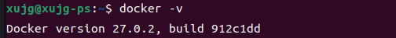

# docker安装

Ubuntu安装Docker 有两种推荐的方法：

-   **从 Ubuntu 的仓库安装 Docker**：简单的单行命令，但提供旧版本
-   **使用 Docker 的官方仓库**：工作量稍多，但提供了最新的稳定版本


### 方法 1：使用 Ubuntu 的仓库安装 Docker

如果你不在意旧版本，并且不想设置和管理仓库，那么这是最适合你的方法。

从更新仓库索引开始：

```bash
apt update
```

现在，你可以使用以下命令在 Ubuntu 中安装 Docker 以及 [Docker Compose](https://linuxhandbook.com/docker-compose-quick-start/)：

```bash
sudo apt install docker.io docker-compose
```

> 📋 Docker 包被命名为 `docker.io`，因为在 Docker 出现之前就已经存在一个名为 docker（用于 Dockerlet 应用）的过渡包。因此，Docker 包必须被命名为其他名称。

安装完成后，你可以使用以下命令检查安装的版本：

```bash
docker -v
```



如你所见，它给了我 Docker 27.0.2。

### 方法 2：在 Ubuntu 中安装最新稳定版本的 Docker

如果你想要 Docker 的最新稳定版本，那么你可以从其官方仓库安装 Docker。

#### 步骤 1：删除任何现有的 Docker 包

但在跳到安装部分之前，有必要删除所有以前安装的 Docker。

要 [卸载以前的 Docker](https://learnubuntu.com/uninstall-docker/)，请使用以下命令。

```bash
sudo apt remove docker.io docker-doc docker-compose docker-compose-v2 podman-docker containerd runc
```

#### 步骤 2：安装依赖项

第一步是安装一些必要的软件包，这些软件包将用于在本教程后面安装 Docker：

```bash
sudo apt install ca-certificates curl gnupg lsb-release
```

你可能已经安装了部分或全部这些软件包，但确认安装没有什么坏处。上面的命令不会伤害你。

#### 步骤 3：添加 Docker 仓库的 GPG 密钥并将其添加到 sources.list

现在，通过 `apt` 包管理器创建一个具有特殊权限的目录，用于存储加密密钥以进行包验证：

```bash
sudo install -m 0755 -d /etc/apt/keyrings
```

接下来，如下所示 [使用 curl 命令](https://learnubuntu.com/install-curl/) 下载并导入 Docker 的 GPG 密钥环：

```bash
curl -fsSL https://download.docker.com/linux/ubuntu/gpg | sudo gpg --dearmor -o /etc/apt/keyrings/docker.gpg
```

下载 GPG 密钥后，[使用 chmod 命令更改文件权限](https://learnubuntu.com/chmod-command/)，以便系统上的每个用户都可以读取 GPG 密钥：

```bash
sudo chmod a+r /etc/apt/keyrings/docker.gpg
```

最后，将 Docker 仓库添加到 `sources.list.d` 文件中：

```bash
echo \
    "deb [arch=$(dpkg --print-architecture) signed-by=/etc/apt/keyrings/docker.gpg] https://download.docker.com/linux/ubuntu \
    $(. /etc/os-release && echo "$VERSION_CODENAME") stable" | \
    sudo tee /etc/apt/sources.list.d/docker.list > /dev/null
```


#### 步骤 4：安装 Docker 和 Docker Compose

现在，要使你对系统所做的更改生效，请更新系统仓库：

```bash
sudo apt update
```

使用以下命令获取最新版本的 Docker 以及其他 Docker 组件和依赖项：

```bash
sudo apt install docker-ce docker-ce-cli containerd.io docker-buildx-plugin docker-compose-plugin
```

> 📋 虽然 [docker.io](http://docker.io/) 包安装了大部分必需的 Docker 组件，但你需要在此处单独进行安装。

要检查已安装的版本，请使用以下命令：

```bash
docker -v
```

测试安装的另一个方法是在 Docker 中使用 “Hello World” 镜像。

让我告诉你如何做。

### 使用 hello-world 镜像来验证 Docker 安装

运行 “Hello World” 程序是我们启动任何编程之旅时都遵循的标准做法，Docker 也是如此。

Docker 为你提供了一个 “Hello World” 镜像，你可以使用它来测试安装。

要安装并运行 “Hello World” 镜像，只需使用以下命令：

```bash
sudo docker run hello-world
```

某些用户在执行上述命令时可能会收到错误消息“无法连接到 Docker 守护进程”：

在这种情况下，**重新启动系统**并再次尝试安装 Docker Hello World 镜像，它将正常工作。

### 💡 额外提示：在 Ubuntu 中使用 Docker 而无需 sudo
使用 sudo 来拉取 Docker 镜像，这并不是使用 Docker 最方便的方式


第一步是使用以下命令 [创建一个名为 docker 的新组](https://learnubuntu.com/add-group/)：

```bash
sudo groupadd docker
```

完成后，使用以下命令将用户添加到 `docker` 组：

```
sudo usermod -aG docker <用户名>
```

> 🚧 确保你只添加具有超级用户权限的用户

现在，注销并重新登录以使更改生效。但如果你使用的是虚拟机，那么必须重新启动。

就是这样！从现在开始，你可以使用 `docker` 命令而不需要 sudo

#### 添加镜像源

在`/etc/docker`目录中添加daemon.json文件,加入阿里云镜像
重启docker服务
```bash
sudo service docker restart
```
然后通过以下命令确定镜像修改成功, 进行查看
```bash 
sudo docker info
```
国内常见的镜像加速器

* Docker 中国官方镜像	[https://registry.docker-cn.com](https://registry.docker-cn.com)
* DaoCloud 镜像站	[http://f1361db2.m.daocloud.io](http://f1361db2.m.daocloud.io)
* Azure 中国镜像	[https://dockerhub.azk8s.cn](https://dockerhub.azk8s.cn)
* 科大镜像站	[https://docker.mirrors.ustc.edu.cn](https://docker.mirrors.ustc.edu.cn)
* 阿里云	[https://ud6340vz.mirror.aliyuncs.com](https://ud6340vz.mirror.aliyuncs.com)
* 七牛云	[https://reg-mirror.qiniu.com](https://reg-mirror.qiniu.com)
* 网易云	[https://hub-mirror.c.163.com](https://hub-mirror.c.163.com)
* 腾讯云	[https://mirror.ccs.tencentyun.com](https://mirror.ccs.tencentyun.com)


#### 配置Docker守护进程使用代理
1.创建或编辑Docker守护进程的代理配置文件：

在 `/etc/systemd/system/docker.service.d` 目录下创建或编辑 `http-proxy.conf` 文件：

```bash
sudo mkdir -p /etc/systemd/system/docker.service.d
sudo nano /etc/systemd/system/docker.service.d/http-proxy.conf
```


2.添加代理配置：

在文件中添加以下内容，使用您的代理地址：

```text
[Service]
Environment="HTTP_PROXY=http://127.0.0.1:7897/"
Environment="HTTPS_PROXY=http://127.0.0.1:7897/"
```
3.重新加载守护进程并重启Docker：

```bash
sudo systemctl daemon-reload
sudo systemctl restart docker
```


4.验证设置是否生效：
您可以使用以下命令查看Docker的代理设置：

```bash
systemctl show --property=Environment docker
```
#### 验证Docker代理设置
```bash
docker info
```
检查输出中的 "HTTP Proxy" 和 "HTTPS Proxy" 设置是否正确。

#### 重新拉取Docker镜像
```bash
sudo docker pull opendronemap/odm
```
