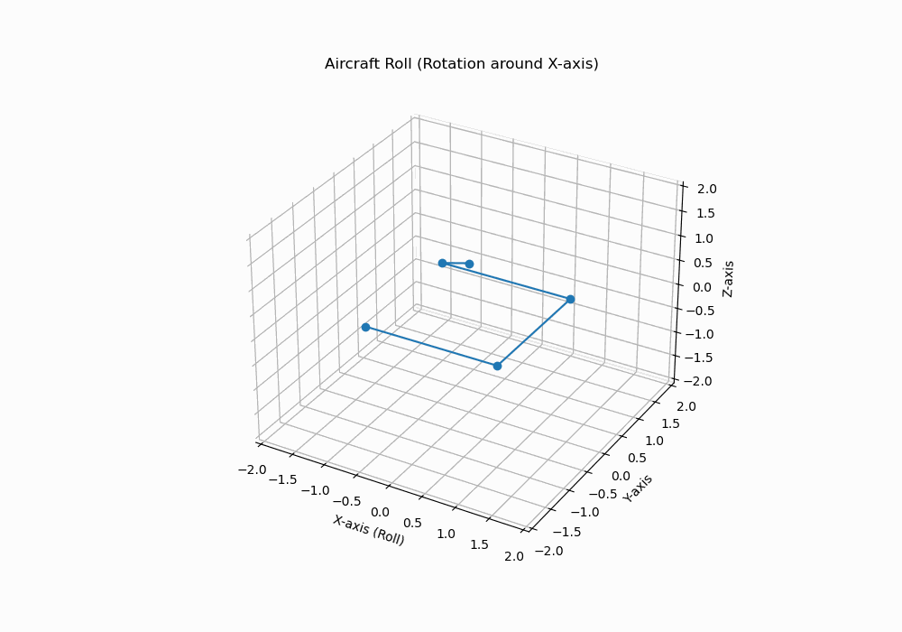
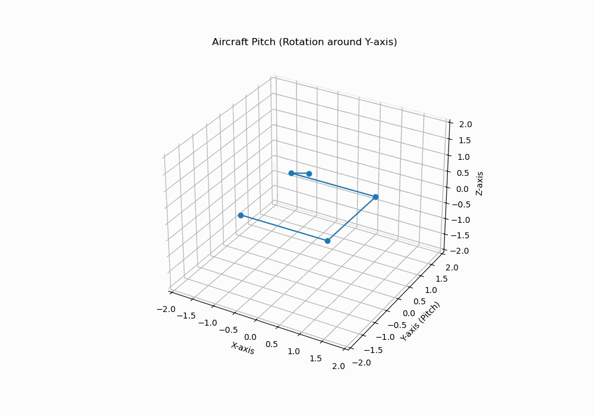
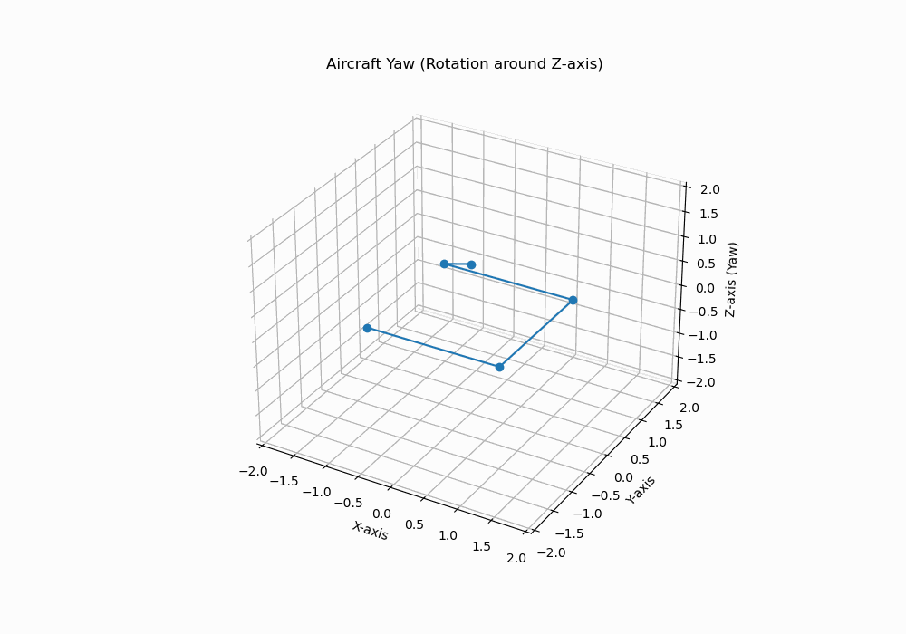
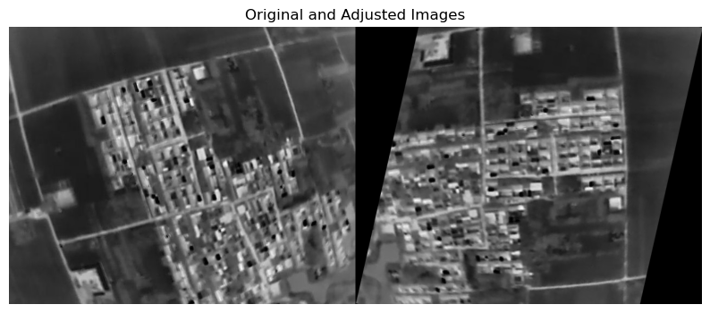

<!--
 * @Descripttion: 
 * @Author: xujg
 * @version: 
 * @Date: 2024-07-12 10:50:17
 * @LastEditTime: 2024-07-12 17:47:25
-->
# 飞行姿态

!!! note
    **滚转角 (roll)**：飞行器绕前后轴（X轴）的旋转角度  
    **俯仰角 (pitch)**：飞行器向上或向下的角度  
    **偏航角 (yaw)**：飞行器向左或向右的角度


python可视化演示：
代码如下：
```python
import matplotlib.pyplot as plt
from matplotlib.animation import FuncAnimation
import numpy as np

# Initialize the figure and axis
fig = plt.figure(figsize=(10, 7))
ax = fig.add_subplot(111, projection='3d')

# Define the aircraft's orientation (simple representation)
aircraft = np.array([[-1, -1, 0],
                     [1, -1, 0],
                     [1, 1, 0],
                     [-1, 1, 0],
                     [0, 0, 1]])

# Function to create rotation matrices
def rotate_aircraft(roll, pitch, yaw):
    R_roll = np.array([[1, 0, 0],
                       [0, np.cos(roll), -np.sin(roll)],
                       [0, np.sin(roll), np.cos(roll)]])
    
    R_pitch = np.array([[np.cos(pitch), 0, np.sin(pitch)],
                        [0, 1, 0],
                        [-np.sin(pitch), 0, np.cos(pitch)]])
    
    R_yaw = np.array([[np.cos(yaw), -np.sin(yaw), 0],
                      [np.sin(yaw), np.cos(yaw), 0],
                      [0, 0, 1]])
    
    return R_yaw @ R_pitch @ R_roll @ aircraft.T

# Animation function for Roll
def animate_roll(i):
    ax.clear()
    roll = np.radians(i % 360)
    rotated_aircraft = rotate_aircraft(roll, 0, 0)
    
    ax.plot3D(rotated_aircraft[0], rotated_aircraft[1], rotated_aircraft[2], 'o-')
    ax.set_xlim([-2, 2])
    ax.set_ylim([-2, 2])
    ax.set_zlim([-2, 2])
    ax.set_xlabel('X-axis (Roll)')
    ax.set_ylabel('Y-axis')
    ax.set_zlabel('Z-axis')
    ax.set_title('Aircraft Roll (Rotation around X-axis)')

# Animation function for Pitch
def animate_pitch(i):
    ax.clear()
    pitch = np.radians(i % 360)
    rotated_aircraft = rotate_aircraft(0, pitch, 0)
    
    ax.plot3D(rotated_aircraft[0], rotated_aircraft[1], rotated_aircraft[2], 'o-')
    ax.set_xlim([-2, 2])
    ax.set_ylim([-2, 2])
    ax.set_zlim([-2, 2])
    ax.set_xlabel('X-axis')
    ax.set_ylabel('Y-axis (Pitch)')
    ax.set_zlabel('Z-axis')
    ax.set_title('Aircraft Pitch (Rotation around Y-axis)')

# Animation function for Yaw
def animate_yaw(i):
    ax.clear()
    yaw = np.radians(i % 360)
    rotated_aircraft = rotate_aircraft(0, 0, yaw)
    
    ax.plot3D(rotated_aircraft[0], rotated_aircraft[1], rotated_aircraft[2], 'o-')
    ax.set_xlim([-2, 2])
    ax.set_ylim([-2, 2])
    ax.set_zlim([-2, 2])
    ax.set_xlabel('X-axis')
    ax.set_ylabel('Y-axis')
    ax.set_zlabel('Z-axis (Yaw)')
    ax.set_title('Aircraft Yaw (Rotation around Z-axis)')

# Create the animations
anim_roll = FuncAnimation(fig, animate_roll, frames=360, interval=20)
anim_roll.save('aircraft_roll.gif', writer='imagemagick')

anim_pitch = FuncAnimation(fig, animate_pitch, frames=360, interval=20)
anim_pitch.save('aircraft_pitch.gif', writer='imagemagick')

anim_yaw = FuncAnimation(fig, animate_yaw, frames=360, interval=20)
anim_yaw.save('aircraft_yaw.gif', writer='imagemagick')
```

结果如下：

### 滚转角 
(roll)：飞行器绕前后轴（X轴）的旋转角度  
* **范围**：从 `-180°` 到 `180°`。  
* **正方向**：如果右机翼向下，左机翼向上，则为正滚转；反之则为负滚转。  


### 俯仰角 
(pitch)：飞行器向上或向下的角度  
* **范围**：从 `-90°` 到 `90°`。  
* **正方向**：如果机头向上，机尾向下，则为正俯仰；反之则为负俯仰。  


### 偏航角
(yaw)：飞行器向左或向右的角度  
* **范围**：从 `-180°` 到 `180°`。  
* **正方向**：如果机头向右，机尾向左，则为正偏航；反之则为负偏航。  



### 根据飞行姿态调整至正射图像

根据上述介绍的偏航角，俯仰角，滚转角校正图像

```python
import cv2
import numpy as np
from matplotlib import pyplot as plt

def euler_to_rotation_matrix(roll, pitch, yaw):
    """
    Convert Euler angles to a rotation matrix.
    """
    R_x = np.array([[1, 0, 0],
                    [0, np.cos(roll), -np.sin(roll)],
                    [0, np.sin(roll), np.cos(roll)]])
    
    R_y = np.array([[np.cos(pitch), 0, np.sin(pitch)],
                    [0, 1, 0],
                    [-np.sin(pitch), 0, np.cos(pitch)]])
    
    R_z = np.array([[np.cos(yaw), -np.sin(yaw), 0],
                    [np.sin(yaw), np.cos(yaw), 0],
                    [0, 0, 1]])
    
    R = np.dot(R_z, np.dot(R_y, R_x))
    return R

def adjust_image(image_path, roll, pitch, yaw):
    """
    Adjust the image to orthographic view using the given roll, pitch, and yaw angles.
    """
    # Read the image
    image = cv2.imread(image_path)
    
    # Image dimensions
    height, width = image.shape[:2]
    
    # Get the rotation matrix
    R = euler_to_rotation_matrix(roll, pitch, yaw)
    
    # Define the source points (four corners of the image)
    src_points = np.array([[0, 0],
                           [width - 1, 0],
                           [width - 1, height - 1],
                           [0, height - 1]], dtype='float32')
    
    # Apply the rotation to the source points
    dst_points = np.dot(src_points - np.array([width / 2, height / 2]), R[:2, :2].T) + np.array([width / 2, height / 2])
    dst_points = dst_points.astype('float32')
    
    # Compute the perspective transform matrix
    matrix = cv2.getPerspectiveTransform(src_points, dst_points)
    
    # Apply the perspective transformation
    adjusted_image = cv2.warpPerspective(image, matrix, (width, height))
    
    return adjusted_image

# Example usage
image_path = 'stamp19291.jpg'
#这个例子我使用的是弧度，角度的话也可以，需要转换
yaw, pitch, roll = 1.793676, 0.061006, -0.014411

adjusted_image = adjust_image(image_path, roll, pitch, yaw)

# Read the original image
original_image = cv2.imread(image_path)

# Concatenate the original and adjusted images horizontally
concatenated_image = np.concatenate((original_image, adjusted_image), axis=1)

# Convert the image from BGR to RGB for displaying using matplotlib
concatenated_image_rgb = cv2.cvtColor(concatenated_image, cv2.COLOR_BGR2RGB)

# Display the concatenated image
plt.figure(figsize=(10, 5))
plt.imshow(concatenated_image_rgb)
plt.axis('off')
plt.title('Original and Adjusted Images')
plt.show()
```

