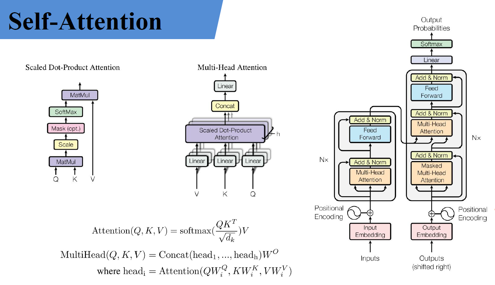
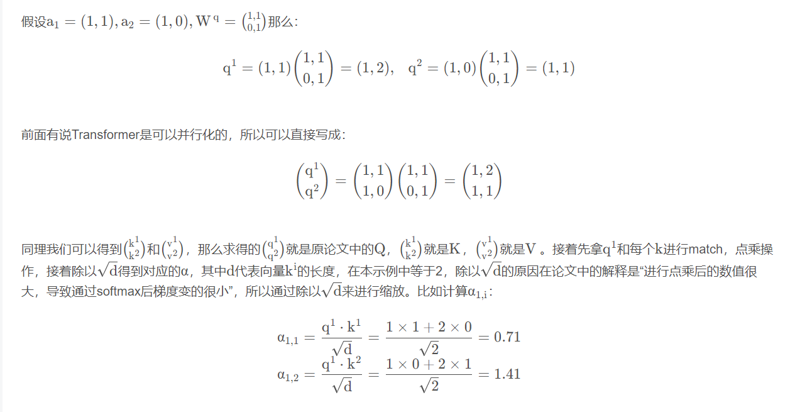
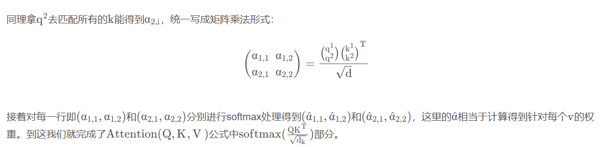
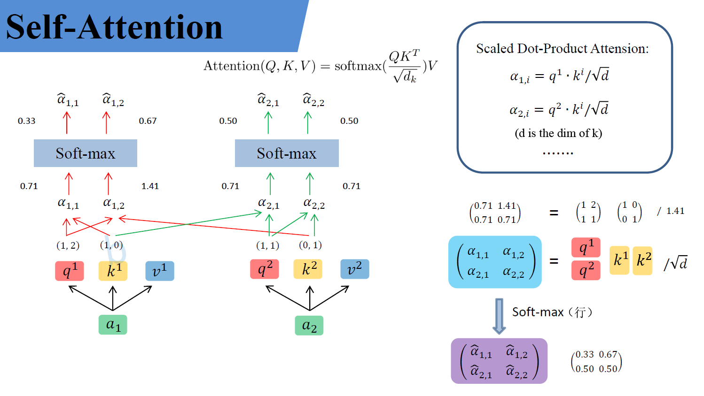
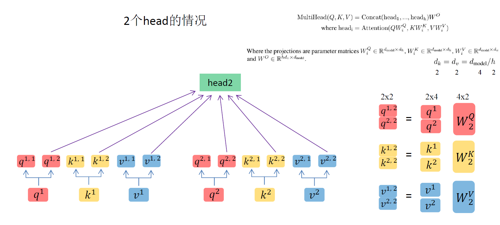
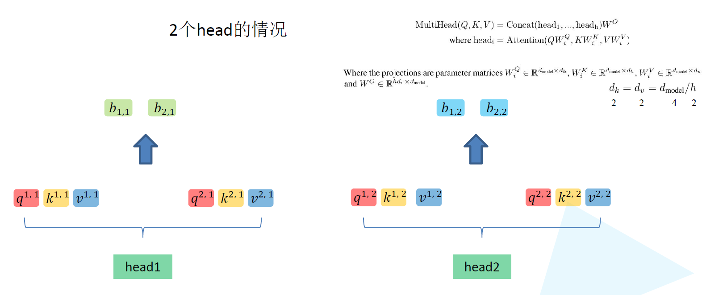
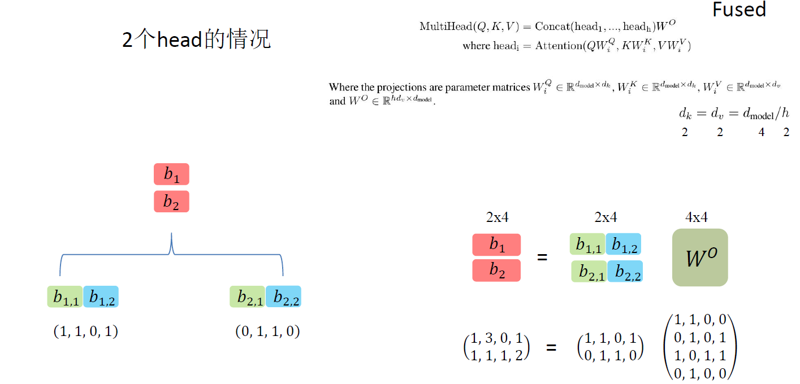

# transformer

2017年提出，广泛应用于各种自然语言处理任务，如机器翻译，文本摘要，文本分类等。
传统的序列模型如循环神经网络RNN在处理长文本时会遇到梯度消失或者梯度爆炸的问题，而transformer网络通过引入自注意力机制来解决这一问题。
自注意力是一种通过对**输入序列的所有位置**进行**注意力**计算，从而同时考虑输入序列中国所有位置信息的方法，在transformer中，输入序列的每个位置都会通过与其他位置的关系进行联系，在Encoder和Decoder中都使用自注意力机制。

在编码器中，自注意力机制将输入序列的每个位置与其他位置进行关联，得到一个加权的表示，这样每个位置都能够同时考虑到其他位置的信息。通过多层堆叠的自注意力机制和前馈神经网络的组合。Encoder将输入序列的每个位置的隐藏表示为查询，键和值，通过计算注意力权重，对序列中的不同位置进行加权求和得到每个位置的输出，这使得Encoder能够获得全局上下文信息，并且可以在处理不同位置时自动捕获序列中的长程依赖关系。在前馈神经网络中，Encoder对每个位置的隐藏表示应用一个全连接层，并使用激活函数对其进行变换，这个层充当了局部模式的提取器，帮助模型更好地捕获到输入序列中的局部关系。

==Embedding==
用于将输入序列中的每个标记转换为向量形式，以便模型能够对其进行处理。在transformer中，有两种类型的embedding：位置编码和词嵌入
**位置编码（相当于加入时间维度）**：transfomer模型不具有任何递归或卷积运算，所以无法直接捕捉输入序列的顺序信息。为了解决这个问题，transformer使用了位置编码。位置编码通过为输入序列中的每个位置分配一个向量，来表示该位置在序列中的相对位置。
**词嵌入**：词嵌入时将离散的词汇表中词转换为低维实数向量的过程。每个词会被映射到一个相应的实数向量，使得词与词之间的相似度可以通过向量之间的距离来衡量。
总结：embedding用于将输入序列中的离散标记转换为可处理的向量表示，以便模型可以对其进行处理和推理。

## **Self-Attention实现步骤：**
- **计算注意力权重**：通过计算输入序列中每个位置与目标位置之间的相似度，使用softmax函数将这些相似度转换为权重。这些权重表示了模型对于输入序列中每个位置的关注程度。**其实就是余弦相似度**
- **加权求和**：将输入序列中的每个位置的向量乘以对应的注意力权重，并对所有位置进行加权求和，得到一个加权和向量。这个加权和向量代表了模型在计算输出时关注的部分。
- **输出计算**：通过将加权和向量输入到一个全连接层或者其他类型的网络层中，计算处最终的输出向量。
通过使用Attention机制，transformer模型能够捕捉输入序列中不同位置之间的相关性，并根据输入的重要性决定在计算输出时的关注程度。这使得transformer能够处理长距离依赖关系，取得显著性能提升。




下面进行具体理解：

假设输入的序列的长度为`2`， 输入就两个节点$x_1$, $x_2$， 然后通过`Input Embeeding`进行映射（**将高维度数据映射到低维度上**）， 如图所示的将输入节点$x_1$, $x_2$通过`f(x)`映射到$a_1$, $a_2$。紧接着分别将$a_1$, $a_2$分别通过三个变换矩阵$W_q$$W_k$$W_v$（这三个参数是可训练的， 是共享的）, 得到对应的$q^i$$k^i$$v^i$（这里直接通过全连接层进行实现的）


其中， 

* `q`代表`query`, 后续会去和每一个`k`进行匹配
* `k`代表`key`， 后续会被每个`q`匹配
* `v`代表从`a`中提取得到的信息
* 后续`q`和`k`匹配的过程可以理解成计算两者的相关性，相关性越大对应v的权重也就越大。







上面已经计算得到$\alpha$， 即针对每个`v`的权重， 接着进行加权得到最终结果：


以上就是`self-Attention`的内容， 总结下来就是论文中的一个公式：
$$
Attention(Q, K, V) = softmax(\frac{QK^T}{\sqrt{d_k}})V
$$
## **Multi-Head Attention**

多头注意力机制能够联合来自不同`head`部分学习到的信息。

首先还是和self-Attention模块一样将$a_i$分别通过$W^q, W^k, W^v$得到对应的$q^i, k^i, v^i$, 然后再根据使用的`head`的数目`h`进一步把得到的$q^i, k^i, v^i$均分成h份， 比如下图中假设`h=2`， 然后$q^1$拆分成$q^{1,1}, q^{1, 2}$

那么$q^{1, 1}$就属于`head1`, $q^{1, 2}$就属于`head2`




通过上述方法就能得到每个$head_i$对应的$Q_i, K_i, V_i$参数， 接下来针对每个`head`使用和`self-Attention`中相同的方法即可得到对应的结果。
$$
Attention(Q_i, K_i, V_i) = softmax(\frac{Q_iK^T}{\sqrt{d_k}})V_i
$$


接着将每个`head`得到的结果进行`concat`拼接， 比如下图中$b_{1, 1}$($head_1$得到的$b_1$)和$b_{1, 2}$（$head_2$得到的$b_1$）拼接在一起，$b_{2, 1}$($head_2$得到的$b_2$)和$b_{2, 2}$（$head_2$得到的$b_2$）拼接在一起，


接着将拼接后的结果通过$W^O$（可学习的参数）进行融合，如下图所示， 融合后得到最终的结果$b_1, b_2$



到这， `Multi-Head Attention`的内容就讲完了， 总结下来就是论文中的两个公式
$$
MuiltiHead(Q, K, V) = Concat(head_1,..., head_h)W^O\\
where~head_i = Attention(QW^Q_i, KW^K_i, VW^V_i)
$$


## 常见问题
***
**1. Transformer为何使用多头注意力机制？（为什么不使用一个头）**

每个头对应一套Wq、Wk、Wv参数矩阵，对应q、k、v的一个表征空间，用多头能在多个表征空间进行attention，提取多种patten信息，提高泛化能力。
***
**2.Transformer为什么Q和K使用不同的权重矩阵生成，为何不能使用同一个值进行自身的点乘？ （注意和第一个问题的区别）**

如果不用参数矩阵，直接用Q和K点乘，那么attention的过程就是一个确定性的过程，没有任何需要学习的参数，表达能力和泛化能力有限。
***
**3.Transformer计算attention的时候为何选择点乘而不是加法？两者计算复杂度和效果上有什么区别？**

点乘是全矩阵运算，可以并行化；加法通常需要一个FFN来计算相似性。二者复杂度差不多，但是点乘由于可以利用高效矩阵运算速度更快。
***
**4.为什么在进行softmax之前需要对attention进行scaled（为什么除以dk的平方根），并使用公式推导进行讲解**

当维度很大时，点乘之后的结果数据量级很大。对于softmax函数而言，一旦输入很大，会进入函数的饱和区，梯度值很小。因而需要scaled。如果输入q和k各自都是均值为0，方差为1的分布，q与k的点积将是均值为0，方差为dk，为了将其方差控制在1，需要除以dk的平方根。
***
**5.在计算attention score的时候如何对padding做mask操作？**

在decoder的mask multi-head attention，即第一个attention模块做mask操作。具体方法：对k向量第t步以后的值在进入softmax之前置一个非常大的负数，在进入softmax之后这个负数对应的位置会变成0，即对应的权重变成0，从而对应的v不会参与计算。之所以不在softmax之后直接置0，是为了保证权重和为1。
***
**6.为什么在进行多头注意力的时候需要对每个head进行降维？（可以参考上面一个问题）**

多头的输出最后会concat到一起继续进行下一层的运算。为了保证concat后输出维度不变，每个head的维度都是d_model / h。

***
**7.大概讲一下Transformer的Encoder模块？**
Transformer的Encoder模块是由一系列相同的层堆叠而成的，每一层都有两个主要的子模块：多头自注意力机制（Multi-Head Self-Attention）和前馈神经网络（Position-wise Feed-Forward Networks）。此外，每个子模块周围都有一个残差连接，并且每个子模块的输出都会经过层归一化（Layer Normalization）。下面是对这些组件的详细说明：

1. 多头自注意力机制（Multi-Head Self-Attention）
这个模块可以使网络在进行预测时考虑输入序列的不同位置，对不同位置的输入分配不同的注意力。多头注意力机制意味着模型有多组不同的注意力参数，每组都会输出一个注意力权重，这些注意力权重会被合并成最终的注意力输出。

2. 残差连接（Residual Connection）
残差连接帮助避免了深度神经网络中的梯度消失问题。在Transformer中，每个子模块的输出是 LayerNorm(x + SubLayer(x))，其中SubLayer(x)是子模块自身（比如多头自注意力或前馈神经网络）的输出。

3. 层归一化（Layer Normalization）
层归一化是在模型的训练过程中加速收敛的一种技术，它对层的输入进行归一化处理，使得其均值为0，方差为1。

4. 前馈神经网络（Position-wise Feed-Forward Networks）
这个模块由两个线性变换组成，中间夹有一个ReLU激活函数。它对每个位置的词向量独立地进行变换。

5. 位置编码（Position Encoding）
由于Transformer模型没有循环或卷积操作，为了让模型能够利用词的顺序信息，需要在输入嵌入层中加入位置编码。位置编码和词嵌入相加后输入到Encoder模块。

整体来看，Transformer的Encoder模块将输入序列转换为一系列连续表示，这些表示在后续的Decoder模块中用于生成输出序列。每一层的Encoder都对输入序列的所有位置同时进行操作，而不是像RNN那样逐个位置处理，这是Transformer模型高效并行处理的关键。
***
**8.为何在获取输入词向量之后需要对矩阵乘以embedding size的开方？意义是什么？**
将词嵌入矩阵乘以嵌入维度（embedding dimension）的平方根是为了对模型进行缩放，目的是防止在计算自注意力（self-attention）时得到的数值过大。在自注意力机制中，我们计算输入序列中每个元素对其他所有元素的注意力分数，这涉及到一个点积操作，可能导致非常大的数值，特别是当嵌入维度较大时。

将嵌入乘以嵌入维度的平方根可以帮助缓解这个问题，使得点积的范围更加合理，从而帮助模型的训练稳定性。这个缩放操作有助于避免在训练过程中出现梯度消失或梯度爆炸的问题，使得模型更容易训练，最终达到更好的性能。

简而言之，这个操作的目的是为了数值稳定性和训练稳定性，帮助模型更有效地学习从输入到输出的映射。

以下是你提出的第 9\~20 条 Transformer 相关问题的简洁回答，适合用于理解和准备面试/答辩：

---

**9. 简单介绍一下 Transformer 的位置编码？有什么意义和优缺点？**
Transformer 是全注意力机制，没有循环结构（如RNN），无法感知序列顺序，因此引入 **位置编码（Positional Encoding）**。常见的是 **正弦余弦位置编码**（Sinusoidal），通过对位置和维度进行周期性映射，加入到输入中：

$$
PE_{(pos, 2i)} = \sin\left(\frac{pos}{10000^{2i/d_{model}}}\right),\quad
PE_{(pos, 2i+1)} = \cos\left(\frac{pos}{10000^{2i/d_{model}}}\right)
$$

* **意义**：注入位置信息，让模型区分“谁在前谁在后”。
* **优点**：无参数、可推广到长序列、具备平移不变性。
* **缺点**：表达能力有限，不适应复杂结构。

---

**10. 你还了解哪些关于位置编码的技术？各自优缺点是什么？**

| 编码方式                               | 说明                           | 优点           | 缺点         |
| ---------------------------------- | ---------------------------- | ------------ | ---------- |
| **Sinusoidal**                     | 固定函数，无训练参数                   | 通用性强，外推性好    | 表达力弱       |
| **Learnable Position Embedding**   | 每个位置一个可学习向量                  | 表达更强         | 不可外推       |
| **Relative Position Encoding**     | 表示位置间的相对关系（如 Transformer-XL） | 适合语言建模、外推性强  | 实现更复杂      |
| **Rotary Position Encoding（RoPE）** | 用复数或旋转矩阵形式嵌入位置关系（如RoFormer）  | 适合多头注意力，计算高效 | 理解门槛稍高     |
| **ALiBi**                          | 用斜率控制距离衰减，无需显式编码             | 无需嵌入、长序列外推性强 | 与具体任务匹配度未知 |

---

**11. 简单讲一下 Transformer 中的残差结构以及意义。**
Transformer 每层采用残差连接（Residual Connection）：

$$
\text{Layer Output} = \text{LayerNorm}(x + \text{SubLayer}(x))
$$

* **意义**：缓解深层网络训练困难，防止梯度消失，加快收敛速度。
* **优点**：梯度更稳定，训练更深的模型。
* **类似结构**：与 ResNet 残差思想相同。

---

**12. 为什么 Transformer 块使用 LayerNorm 而不是 BatchNorm？LayerNorm 在 Transformer 的位置是哪里？**

* **原因**：

  * BatchNorm 依赖 batch 维度，NLP 中序列长度不定、batch size 小，效果差。
  * LayerNorm 是在特征维度做归一化，适合 NLP。
* **位置**：原论文为 **Post-LN** 结构，在残差后再 LayerNorm：

  ```text
  output = LayerNorm(x + Sublayer(x))
  ```

  也有变种如 **Pre-LN**，先 LayerNorm 再做残差结构，训练更稳定。

---

**13. 简单讲一下 BatchNorm 技术，以及它的优缺点。**

* **原理**：对每个 mini-batch 的特征进行标准化：

$$
\hat{x} = \frac{x - \mu}{\sqrt{\sigma^2 + \epsilon}}
$$

* **优点**：

  * 缓解梯度消失/爆炸，提升训练速度；
  * 减少对初始化的依赖。
* **缺点**：

  * 在小 batch size 时不稳定；
  * 与循环/自注意力不兼容。

---

**14. 简单描述一下 Transformer 中的前馈神经网络？使用了什么激活函数？相关优缺点？**

* **结构**：

  $$
  FFN(x) = \text{ReLU}(xW_1 + b_1)W_2 + b_2
  $$

  通常是两层线性网络，中间是非线性激活。
* **激活函数**：原版使用 **ReLU**，也有 GELU（如BERT）。
* **优点**：增强特征表示能力；
* **缺点**：参数多、计算量大，对长序列处理存在瓶颈。

---

**15. Encoder 端和 Decoder 端是如何进行交互的？（关联 seq2seq 的 Attention）**

* **交互方式**：Decoder 的中间层通过 **Encoder-Decoder Attention** 获取 Encoder 的输出（记忆）。
* **机制**：每个 Decoder token 查询 Encoder 全部 token 的信息，等价于 seq2seq 中的 attention：

$$
\text{Attention}(Q_{dec}, K_{enc}, V_{enc})
$$

---

**16. Decoder 阶段的多头自注意力和 Encoder 的多头自注意力有什么区别？为什么 Decoder 自注意力需要 sequence mask？**

* **区别**：

  * **Encoder**：自注意力允许看到整个序列；
  * **Decoder**：自注意力需要使用 **causal mask** 防止看见未来的信息。
* **原因**：训练时输入完整句子，但预测时必须一步一步生成，防止“信息泄露”。

---

**17. Transformer 的并行化体现在什么地方？Decoder 可以做并行化吗？**

* **并行化体现在**：

  * 自注意力结构可并行计算，不像 RNN 需要前后依赖；
  * 前馈网络、位置编码等也可并行。
* **Decoder 并行化**：

  * 训练阶段可并行；
  * **推理阶段不能完全并行**，必须一步步生成，因为后一个 token 依赖前一个。

---

**19. Transformer 训练时的学习率是如何设定的？Dropout 是如何设定的，位置在哪里？测试时需要注意什么？**

* **学习率策略**（原论文）：

  $$
  lr = d_{\text{model}}^{-0.5} \cdot \min(\text{step}^{-0.5}, \text{step} \cdot \text{warmup}^{-1.5})
  $$

  即先 warmup 再衰减。
* **Dropout 位置**：

  * 应用于 attention 权重；
  * 应用于 FFN 层输出；
  * 有时也用于 embedding。
* **测试时注意**：Dropout 会自动关闭，无需显式处理。

---

**20. 解码端的残差结构有没有把后续未被看见的 mask 信息添加进来，造成信息的泄露？**

* **不会造成信息泄露**。
* 因为 **mask 是加在 attention 权重计算前的**，即：

$$
\text{softmax}(QK^T / \sqrt{d_k} + \text{mask})
$$

* 即使残差结构加回来的是当前 token 的输出，也不包含未来信息，因为未来 token 本身没有被参与 attention。

---

