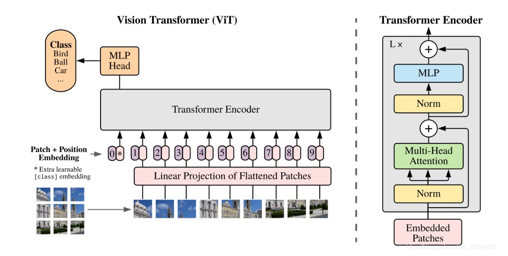
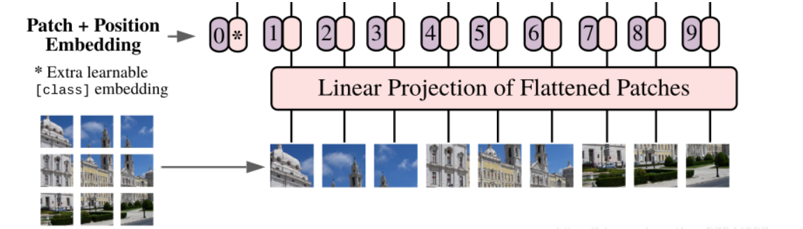
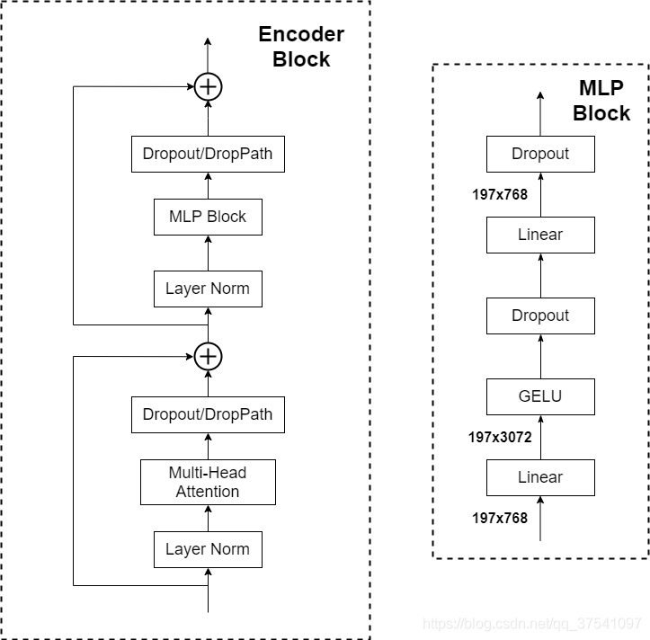

# ViT

下图是原论文中给出的关于Vision Transformer的模型框架， 简单而言，模型由三个模块组成：

* Linear Projection of Flattened Patches(Embedding层)
* Transformer Encoder(图右)
* MLP Head(最终用于分类的层结构)

对于图像数据而言，其数据格式为[H, W, C]是三维矩阵明显不是transformer想要的。所以需要先通过一个Embedding层来对数据做个变换， 如下图所示， 首先将一张图片按给定大小分为 一堆Patches。以ViT-B/16为例， 将输入图片(224, 224)按照16x16大小的Patch进行划分， 划分后会得到$(224/16)^2=196$个Patches。接着通过线性映射将每个Patch映射到一维向量中，每个Patches数据shape为[16, 16, 3]通过映射得到一个长度为768的向量（后面都直接称为token）

**在代码实现中， 直接通过一个卷积层来实现**。直接使用一个卷积核大小为16x16， 步距为16， 卷积核个数为768的卷积来实现， 通过卷积`[224, 224, 3] -> [14, 14, 768]`， 然后直接把H和W两个维度展平即可`[14, 14, 768] -> [196, 768]`, 此时正好变成了一个二维矩阵，正是transformer想要的。

**在输入Transformer Encoder之前注意需要加上[class]token以及Position Embedding**。在原论文中， 在刚刚得到的token中插入一个专门用于分类的[class]token， 这个[class]token是一个可训练的参数，数据格式和其他token一样都是一个向量， 长度为[768]， 与之前从图片中生成的tokens拼接在一起， `cat([1, 768], [196, 768]) -> [197, 768]`。然后关于Position Embedding就是之前Transformer中将的位置编码， 这里的位置编码采用的是一个可训练的参数(`1D, Pos. Emb.`)， 是直接叠加在tokens上的， 所以shape要一样， 刚刚拼接[class]token后shape是`[197, 768]`， 那么这里的Position Embedding的shape也是`[197, 768]`

**Transformer Encoder详解**

Transformer Encoder其实就是重复堆叠Encoder Block L次， 主要由以下几部分组成：

* Layer Norm , 这种Normalization方法主要针对NLP提出的， 这里是对每个token进行Norm处理
* Multi-Head Attention, 这个结构之前在讲Transformer 中很详细的讲过
* Dropout/DropPath
* MLP Block， 如图所示， 就是全连接+GELU激活函数+Dropout组成， 需要注意的是第一个全连接层会把输入节点个数翻4倍`[197, 768]->[197, 3072]`， 第二个全连接层会还原回原来的节点个数`[197, 3072] -> [197, 768]`

**MLP Head**

上面通过Transformer Encoder后输出的shape和输入的shape是保持不变的， 输入的是`[197, 768]`， 输出的是还是`[197, 768]`。我们只需要提取出[class]token生成的对应结果就行， 即`[197, 768]`中抽取出[class]token对应的`[1, 768]`。接着我们通过MLP Head得到我们最终的分类结果， MLP Head原论文中说在训练ImageNet21K时是由`Linear + tanh激活函数 +Linear`组成， 但是迁移到Image1K上时， 只用一个Linear即可。