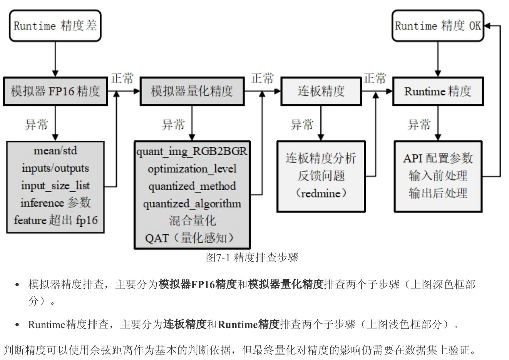

# RKNN
RKNN（Rockchip Neural Network）是 瑞芯微（Rockchip） 推出的专用于其 NPU（Neural Processing Unit，神经网络处理器）平台上的 AI 模型部署工具链。它的主要目标是将主流深度学习框架（如 PyTorch、TensorFlow、ONNX 等）训练出的模型转换并部署到 Rockchip 芯片（如 RK1808、RK3399Pro、RK356x、RK3588 等）上高效运行

## 1. RKNN工具链介绍

### **1.1 模型输入阶段**

模型训练阶段，支持的框架包括：

* **PyTorch**
* **ONNX**
* **TensorFlow**
* **TFLite**
* **Caffe**
* **Darknet**

✅ **说明：**
这些是常见的训练框架或中间模型格式，开发者通常使用它们训练出模型文件（如 `.pt`, `.onnx`, `.tflite`, `.pb` 等）。


### **1.2 模型转换阶段(RKNN-Toolkit2)**

这一阶段通过 **RKNN-Toolkit2 工具包**，将上述模型转换为 `.rknn` 格式的模型。

✔️ **处理流程如下：**

1. **加载模型**
   使用 `rknn.load_onnx()` / `rknn.load_tflite()` 等方式载入。

2. **配置参数**
   设置 `mean/std`、输入尺寸、量化方式、目标平台等。

3. **量化（可选）**
   使用校准数据进行 INT8 量化，加速推理、降低功耗。

4. **图优化 + 编译**
   对模型图进行优化、融合常量、格式对齐，然后生成 `.rknn` 文件。

✅ 最终产物是：一个可以被 Rockchip NPU 执行的 `.rknn` 模型。


### **1.3 模型部署与执行阶段**

这部分运行在 **RK 芯片设备端**：

#### 1.3.1 **RK-NPU Hardware（硬件层）**

* Rockchip 芯片（如 RK3588）内部的 NPU 硬件模块，负责矩阵计算、卷积加速。

#### 1.3.2 **RK-NPU Driver（驱动层）**

* Linux 内核中的 NPU 驱动模块，例如 `/dev/rknpu`，与硬件交互。
* 通过 `librknn_runtime.so` 与上层接口通信，完成内存分配、模型调度、任务提交。

#### 1.3.3 **RKNN API（运行时 API）**

* 提供 Python / C / C++ 接口，用于：

  * 加载 `.rknn` 模型
  * 初始化 NPU
  * 设置输入 / 获取输出
  * 控制推理流程

#### 1.3.4 **AI Apps（应用层）**

* 开发者编写的 AI 应用，比如：

  * 视频检测、人脸识别、目标跟踪系统
  * 使用 RKNN API 调用推理结果进行处理或控制逻辑


### 1.4 流程

```text
【模型训练】 → PyTorch/TF等
      ↓
【模型转换】 → RKNN Toolkit2
      ↓
【生成.rknn】 → 部署到设备
      ↓
【模型加载】 → RKNN API（Python/C/C++）
      ↓
【驱动调用】 → RK-NPU Driver（内核模块）
      ↓
【推理执行】 → RK-NPU Hardware
      ↓
【结果返回】 → 用户AI应用使用输出结果
```

## 2. 模型训练

略

## 3. 模型转换


RKNN-Toolkit2是为用户提供在计算机上进行模型转换、推理和性能评估的开发套件，RKNN-Toolkit2的
主要框图如下：

通过该工具提供的Python接口可以便捷地完成以下功能：
1. **模型转换**：支持将PyTorch、ONNX、TensorFlow、TensorFlow Lite、Caffe、DarkNet等模型转为RKNN模型
2. **量化功能**：支持将浮点模型量化为定点模型，并支持混合量化
3. **性能和内存评估**：将RKNN模型分发到指定NPU设备上运行，以评估模型在实际设备上运行时的性能和内存占用情况
4. **量化精度分析**：该功能将给出模型量化后每一层推理结果与浮点模型推理结果的余弦距离和欧氏距离，以便于分析量化误差是如何出现的，为提高量化模型的精度提供思路


### 3.1 量化

模型量化是指将 高精度（通常是 FP32）模型参数和激活值压缩为低精度（如 INT8）表示 的过程。优点包括：

- 减少模型大小（减少内存占用）
- 加快推理速度（低精度计算更快）
- 降低功耗（适合嵌入式端）


**线性量化公式**：

从 float → int：

```text
quantized = round((float_value - zero_point) / scale)
```

从 int → float（反量化）：

```text
float_value = scale × (quantized - zero_point)
```


#### 3.1.1 **对称量化 vs 非对称量化**

**1.对称量化（Symmetric Quantization）**

* 映射中心是 `0`
* `zero_point = 0`
* `scale = max(|min|, |max|) / (2^(bitwidth-1) - 1)`

```text
INT8 范围是 [-127, 127]
float范围为 [-6.35, 6.35]
```

好处：简单、高效、硬件实现容易
缺点：不能准确量化非零均值的分布

---

**2.非对称量化（Asymmetric Quantization）**

* 映射中心是 `min_value`
* 支持任意零点 `zero_point ∈ [0, 255]`
* `scale = (max - min) / (quant_max - quant_min)`
* `zero_point = quant_min - round(min / scale)`

适合分布不对称的数据


#### 3.1.2 **Per-Layer vs Per-Channel 量化**

**1.Per-Layer**：

* 整个 tensor 使用同一个 `scale` 和 `zero_point`
* 简单、高效
* 但对分布不均匀的通道损失大

**2.Per-Channel**：

* 每个输出通道都有独立的 `scale`（只作用于**权重**）
* 适用于卷积等层，显著提高精度
* NPU 需要支持向量化或广播乘法

举例：

* 卷积层权重是 `[C_out, C_in, H, W]`
* 每个 `C_out` 都独立量化（一个 scale）

---

#### 3.1.3 **量化范围计算**


**为什么要用这些算法来确定量化范围？**

默认做量化时，我们会简单取：

```text
min_value = tensor.min()
max_value = tensor.max()
```

但这样做容易受\*\*极端异常值（outliers）\*\*影响 —— 比如 99.9% 的值都集中在 \[-1, 1]，但有一个值是 100，那么整个 scale 会被拉大，导致精度降低。

所以我们需要更智能的方式来确定一个“更合适”的量化范围，**保留主要分布的信息，同时丢弃对结果影响小的异常值**。


**1️⃣ Normal（基于高斯分布假设）**

**原理**：

* 假设激活值服从高斯分布（Normal Distribution）
* 根据统计学特性，用标准差σ控制范围（例如 \[-3σ, 3σ]）
* 通常取范围包含 99.7% 的数据

**优点**：

* 计算简单、速度快
* 对中等分布的数据效果尚可

**缺点**：

* 如果激活值不是正态分布（如 ReLU 输出全是非负偏态），效果较差


2️⃣ **KL散度法（Kullback–Leibler Divergence）** ★常用★

**原理**：

* 枚举多个候选的截断区间 `[a, b]`
* 每个区间将 float 值离散为直方图（P），再映射为 int8 直方图（Q）
* 计算 P 与 Q 的 KL 散度（衡量信息损失）
* 选择使 KL 散度最小的范围作为最终量化区间

**公式**：

```text
KL(P || Q) = Σ P(x) * log(P(x)/Q(x))
```

**优点**：

* 能保留最多的信息量
* 适合分布复杂、偏态、带尾部的输出（如 ReLU）

**缺点**：

* 计算复杂，速度慢一些
* 需要较大样本量才能统计稳定


3️⃣ **MMSE（最小均方误差）**

**原理**：

* 遍历不同的截断范围 `[a, b]`
* 对每个候选范围，模拟量化→反量化过程
* 计算误差：

```text
MSE = mean((fp32_tensor - dequantized_tensor)^2)
```

* 选使误差最小的区间作为最终量化区间

**优点**：

* 与实际值的数值误差最小
* 精度有时甚至优于 KL 散度

**缺点**：

* 计算较复杂，速度慢
* 与实际任务损失（如分类交叉熵）不直接相关


**对比总结**

| 方法     | 假设/思想      | 优点        | 缺点          | 适合分布类型          |
| ------ | ---------- | --------- | ----------- | --------------- |
| Normal | 假设数据服从正态分布 | 快速、简单     | 不适合偏态/非对称分布 | 对称、无偏数据         |
| KL散度   | 信息损失最小     | 精度好、信息保留多 | 慢、对样本依赖较大   | 非对称、偏态分布（如ReLU） |
| MMSE   | 最小均方误差     | 对数值拟合最优   | 慢、不保证任务精度   | 对精度要求极高任务       |


####  3.1.4 量化配置

**量化数据类型**： 线性非对称INT8
**量化算法**： Normal(default), KL-Divergence, MMSE
**量化方法**： Per-Layer, Per-Channel(Default)
**量化数据集**： 计算激活值（各层的输出值）的量化范围， 应包含实际场景中不同类型的图像，一般推荐校正数据集为20-200张。


### 3.2 精度评估


TODO

### 3.3 性能评估

## 4. 模型部署

`RKNN Runtime`负责加载RKNN模型，并调用NPU驱动实现在NPU上推理RKNN模型。推理RKNN模型时，包括**原始数据输入预处理**、**NPU运行模型**、**输出后处理**三项流程。根据不同模型输入格式和量化方式，RKNN Runtime提供通用API和零拷贝API两种处理流程

### 4.1 通用API
**通用API推理**：对数据的**归一化**、**量化**、**数据排布格式转换**、**反量化**等均在CPU上运行（在符合零拷贝输入要求的情况下，归一化和量化会运行在NPU上，但输入数据仍需要用CPU拷贝到模型的输入buffer上），**模型本身的推理**在NPU上运行


**板端C API推理**


**RKNN通用API接口调用流程**：
1. 调用 `rknn_init()` 接口初始化模型；
2. 调用 `rknn_query()` 接口查询模型的输入输出属性；
3. 对输入进行前处理；
4. 调用 `rknn_inputs_set()` 接口设置输入数据;
5. 调用 `rknn_run()` 接口进行模型推理；
6. 调用 `rknn_outputs_get()` 接口获取推理结果数据；
7. 对输出进行后处理；
8. 调用 `rknn_outputs_release()` 接口释放输出数据内存；
9. 调用 `rknn_destroy()` 接口销毁RKNN;

**通用API调用流程代码示例**

```cpp
// Init RKNN model
ret = rknn_init(&ctx, model, model_len, 0, NULL);
// Get Model Input Output Number
rknn_input_output_num io_num;
ret = rknn_query(ctx, RKNN_QUERY_IN_OUT_NUM, &io_num, sizeof(io_num));
// Get Model Input Info
rknn_tensor_attr input_attrs[io_num.n_input];
memset(input_attrs, 0, sizeof(input_attrs));
for (int i = 0; i < io_num.n_input; i++)
{
      input_attrs[i].index = i;
      ret = rknn_query(ctx, RKNN_QUERY_INPUT_ATTR, &(input_attrs[i]), sizeof(rknn_tensor_attr));
}
// Get Model Output Info
rknn_tensor_attr output_attrs[io_num.n_output];
memset(output_attrs, 0, sizeof(output_attrs));
for (int i = 0; i < io_num.n_output; i++)
{
      output_attrs[i].index = i;
      ret = rknn_query(ctx, RKNN_QUERY_OUTPUT_ATTR, &(output_attrs[i]), sizeof(rknn_tensor_attr));
}
rknn_input inputs[io_num.n_input];
rknn_output outputs[io_num.n_output];
memset(inputs, 0, sizeof(inputs));
memset(outputs, 0, sizeof(outputs));
// Pre-process
// Read Image
image_buffer_t src_image;
memset(&src_image, 0, sizeof(image_buffer_t));
ret = read_image(image_path, &src_image);
// Set Input Data
inputs[0].index = 0;
inputs[0].type = RKNN_TENSOR_UINT8;
inputs[0].fmt = RKNN_TENSOR_NHWC;
inputs[0].size = src_image.size;
inputs[0].buf = src_image.virt_addr;
ret = rknn_inputs_set(rknn_ctx, io_num.n_input, inputs);
// Run
ret = rknn_run(rknn_ctx, nullptr);
// Get Output Data
ret = rknn_outputs_get(rknn_ctx, io_num.n_output, outputs, NULL);
// Post-process
post_process(outputs, results);
// Release RKNN Output
rknn_outputs_release(rknn_ctx, io_num.n_output, outputs);
if (rknn_ctx != 0)
{
      rknn_destroy(rknn_ctx);
}
```

### 4.2 零拷贝API

**零拷贝API推理**：流程如图所示。优化了通用API的数据处理流程，**归一化**、**量化**和**模型推理**都会在NPU上运行，NPU**输出的数据排布格式**和**反量化**过程在CPU或者NPU上运行。零拷贝API对于输入数据流程的处理效率会比通用API高。支持数据在不同的IP核之间流动，没有数据拷贝，减少CPU及DDR带宽消耗。比如通过camera或者解码出来的数据，支持零拷贝导入到NPU中使用


**板端C 零拷贝API推理**


**RKNN零拷贝API接口调用流程**：
1. 调用 `rknn_init()` 接口初始化模型；
2. 调用 `rknn_query()` 接口查询模型的输入输出属性；
3. 使用 `rknn_create_mem()` 分配输入输出内存；
4. 调用 `rknn_set_io_mem()` 绑定输入输出内存（一次性）；
5. 对输入进行前处理，并将数据 `memcpy` 到绑定的输入内存；
6. 调用 `rknn_run()` 接口进行模型推理；
7. 直接使用绑定的输出内存（无需调用 `rknn_outputs_get()`）进行后处理；
8. 不需要调用 `rknn_outputs_release()`；
9. 调用 `rknn_destroy()` 接口销毁 RKNN 句柄

**通用API调用流程代码示例**
```cpp
// 1. 初始化模型
ret = rknn_init(&ctx, model, model_len, 0, NULL);

// 2. 查询输入输出数量
rknn_input_output_num io_num;
ret = rknn_query(ctx, RKNN_QUERY_IN_OUT_NUM, &io_num, sizeof(io_num));

// 3. 查询输入信息
rknn_tensor_attr input_attrs[io_num.n_input];
memset(input_attrs, 0, sizeof(input_attrs));
for (int i = 0; i < io_num.n_input; i++)
{
    input_attrs[i].index = i;
    ret = rknn_query(ctx, RKNN_QUERY_INPUT_ATTR, &input_attrs[i], sizeof(rknn_tensor_attr));
}

// 4. 查询输出信息
rknn_tensor_attr output_attrs[io_num.n_output];
memset(output_attrs, 0, sizeof(output_attrs));
for (int i = 0; i < io_num.n_output; i++)
{
    output_attrs[i].index = i;
    ret = rknn_query(ctx, RKNN_QUERY_OUTPUT_ATTR, &output_attrs[i], sizeof(rknn_tensor_attr));
}

// 5. 创建输入输出内存（Zero-Copy核心）
rknn_tensor_mem* input_mems[io_num.n_input];
rknn_tensor_mem* output_mems[io_num.n_output];

// 分配输入内存（如 640x640x3）
input_mems[0] = rknn_create_mem(ctx, input_attrs[0].size_with_stride);

// 分配输出内存（注意需按 float32 推理）
for (int i = 0; i < io_num.n_output; ++i)
{
    int out_size = output_attrs[i].n_elems * sizeof(float);
    output_mems[i] = rknn_create_mem(ctx, out_size);
}

// 6. 绑定输入输出内存（一次性绑定，推理可复用）
input_attrs[0].type = RKNN_TENSOR_UINT8;
input_attrs[0].fmt  = RKNN_TENSOR_NHWC;
ret = rknn_set_io_mem(ctx, input_mems[0], &input_attrs[0]);

for (int i = 0; i < io_num.n_output; i++)
{
    output_attrs[i].type = RKNN_TENSOR_FLOAT32;
    ret = rknn_set_io_mem(ctx, output_mems[i], &output_attrs[i]);
}

// 7. 读取图像并预处理
image_buffer_t src_image;
memset(&src_image, 0, sizeof(image_buffer_t));
ret = read_image(image_path, &src_image);

image_buffer_t resized_image;
memset(&resized_image, 0, sizeof(image_buffer_t));
resized_image.width = input_attrs[0].dims[2];
resized_image.height = input_attrs[0].dims[1];
resized_image.format = IMAGE_FORMAT_RGB888;
resized_image.size = resized_image.width * resized_image.height * 3;
resized_image.virt_addr = (uint8_t*)malloc(resized_image.size);

// 图像缩放（letterbox等）
ret = convert_image_with_letterbox(&src_image, &resized_image, NULL, 114);

// 将预处理后的数据写入 input_mems
memcpy(input_mems[0]->virt_addr, resized_image.virt_addr, resized_image.size);

// 8. 推理
ret = rknn_run(ctx, nullptr);

// 9. 获取输出数据（直接指向 output_mems[i]->virt_addr）
rknn_output outputs[io_num.n_output];
for (int i = 0; i < io_num.n_output; i++)
{
    outputs[i].index = i;
    outputs[i].is_quant = 0;
    outputs[i].buf = output_mems[i]->virt_addr;
    outputs[i].size = output_attrs[i].n_elems * sizeof(float);
}

// 10. 后处理
post_process(outputs, results);

// 11. 释放图像内存
free(resized_image.virt_addr);
release_image(&src_image);

// 12. 销毁 RKNN 上下文
if (ctx > 0) {
    rknn_destroy(ctx);
}

```
| 步骤         | 普通方式                                        | 零拷贝方式                                         |
| ---------- | ------------------------------------------- | --------------------------------------------- |
| 模型初始化      | ✅ 一样，用 `rknn_init`                          |        -                                       |
| 获取模型输入输出信息 | ✅ 一样，使用 `rknn_query`                        |           -                                    |
| 输入输出属性结构处理 | ✅ 一样，使用 `rknn_tensor_attr`                  |         -                                      |
| **内存分配**   | ❌ 不手动分配，推理时传 `rknn_inputs` 和 `rknn_outputs` | ✅ 手动使用 `rknn_create_mem()` 创建内存               |
| **内存绑定**   | ❌ 不绑定内存                                     | ✅ 使用 `rknn_set_io_mem()` 手动绑定 input/output 内存 |
| 数据输入方式     | 构造 `rknn_input inputs[]`<br>设置 `.buf`                      | 直接将数据填充进已绑定的 `rknn_tensor_mem->virt_addr`     |
| 数据输出方式     | 构造 `rknn_output outputs[]`<br>调用 `rknn_outputs_get()` 获取数据 | 直接指向 `output_mem[i]->virt_addr`|
| 推理执行 | `rknn_run(ctx, NULL)`                                      | `rknn_run(ctx, NULL)`                  |
| 💾 数据拷贝 | 每次都拷贝 `input -> RKNN内部`                                    | 一次 memcpy 到绑定 mem                      |
| 💡 优点   | 简单，API 完善                                                  | 快，延迟低                                  | 


### 4.3 yolov5 demo 

#### 4.3.1 通用方式初始化

```cpp
int init_yolov5_model(const char *model_path, rknn_app_context_t *app_ctx)
{
    int ret;
    int model_len = 0;
    rknn_context ctx = 0;

    // 1. 加载模型并初始化
    unsigned char* model = load_model(model_path, &model_len);
    if (!model) return -1;
    ret = rknn_init(&ctx, model, model_len, 0, NULL);
    free(model);
    if (ret < 0) return -1;

    // 2.查询输入输出个数
    rknn_input_output_num io_num;
    ret = rknn_query(ctx, RKNN_QUERY_IN_OUT_NUM, &io_num, sizeof(io_num));
    if (ret != RKNN_SUCC) return -1;

    // 3.查询输入输出属性
    rknn_tensor_attr input_attrs[io_num.n_input];
    memset(input_attrs, 0, sizeof(input_attrs));
    for (int i = 0; i < io_num.n_input; i++) {
        input_attrs[i].index = i;
        rknn_query(ctx, RKNN_QUERY_INPUT_ATTR, &input_attrs[i], sizeof(rknn_tensor_attr));
    }

    rknn_tensor_attr output_attrs[io_num.n_output];
    memset(output_attrs, 0, sizeof(output_attrs));
    for (int i = 0; i < io_num.n_output; i++) {
        output_attrs[i].index = i;
        rknn_query(ctx, RKNN_QUERY_OUTPUT_ATTR, &output_attrs[i], sizeof(rknn_tensor_attr));
    }

    // 4.保存信息到上下文
    app_ctx->rknn_ctx = ctx;
    app_ctx->io_num = io_num;
    app_ctx->input_attrs = (rknn_tensor_attr *)malloc(io_num.n_input * sizeof(rknn_tensor_attr));
    memcpy(app_ctx->input_attrs, input_attrs, io_num.n_input * sizeof(rknn_tensor_attr));
    app_ctx->output_attrs = (rknn_tensor_attr *)malloc(io_num.n_output * sizeof(rknn_tensor_attr));
    memcpy(app_ctx->output_attrs, output_attrs, io_num.n_output * sizeof(rknn_tensor_attr));
    app_ctx->is_quant = (output_attrs[0].qnt_type == RKNN_TENSOR_QNT_AFFINE_ASYMMETRIC &&
                         output_attrs[0].type != RKNN_TENSOR_FLOAT16);

    // 提取模型输入大小
    if (input_attrs[0].fmt == RKNN_TENSOR_NCHW) {
        app_ctx->model_channel = input_attrs[0].dims[1];
        app_ctx->model_height = input_attrs[0].dims[2];
        app_ctx->model_width = input_attrs[0].dims[3];
    } else {
        app_ctx->model_height = input_attrs[0].dims[1];
        app_ctx->model_width = input_attrs[0].dims[2];
        app_ctx->model_channel = input_attrs[0].dims[3];
    }

    return 0;
}
```

#### 4.3.2 zero-copy方式初始化

```cpp
int init_yolov5_zero_copy_model(const char *model_path, rknn_app_context_t *app_ctx)
{
    int ret, model_len = 0;
    rknn_context ctx = 0;

    // 1. 加载模型并初始化
    unsigned char* model = load_model(model_path, &model_len);
    if (!model) return -1;
    ret = rknn_init(&ctx, model, model_len, 0, NULL);
    free(model);
    if (ret < 0) return -1;

    // ✅ 和普通方式相同：查询输入输出个数
    rknn_input_output_num io_num;
    ret = rknn_query(ctx, RKNN_QUERY_IN_OUT_NUM, &io_num, sizeof(io_num));
    if (ret != RKNN_SUCC) return -1;

    // ✅ 查询输入输出属性
    rknn_tensor_attr input_attrs[io_num.n_input];
    memset(input_attrs, 0, sizeof(input_attrs));
    for (int i = 0; i < io_num.n_input; i++) {
        input_attrs[i].index = i;
        rknn_query(ctx, RKNN_QUERY_INPUT_ATTR, &input_attrs[i], sizeof(rknn_tensor_attr));
    }

    rknn_tensor_attr output_attrs[io_num.n_output];
    memset(output_attrs, 0, sizeof(output_attrs));
    for (int i = 0; i < io_num.n_output; i++) {
        output_attrs[i].index = i;
        rknn_query(ctx, RKNN_QUERY_OUTPUT_ATTR, &output_attrs[i], sizeof(rknn_tensor_attr));
    }

    // ✅ 保存信息到上下文
    app_ctx->rknn_ctx = ctx;
    app_ctx->io_num = io_num;
    app_ctx->is_quant = (output_attrs[0].qnt_type == RKNN_TENSOR_QNT_AFFINE_ASYMMETRIC &&
                         output_attrs[0].type != RKNN_TENSOR_FLOAT16);

    app_ctx->input_attrs = (rknn_tensor_attr *)malloc(io_num.n_input * sizeof(rknn_tensor_attr));
    memcpy(app_ctx->input_attrs, input_attrs, io_num.n_input * sizeof(rknn_tensor_attr));
    app_ctx->output_attrs = (rknn_tensor_attr *)malloc(io_num.n_output * sizeof(rknn_tensor_attr));
    memcpy(app_ctx->output_attrs, output_attrs, io_num.n_output * sizeof(rknn_tensor_attr));

    // ✅ 提取模型输入大小
    if (input_attrs[0].fmt == RKNN_TENSOR_NCHW) {
        app_ctx->model_channel = input_attrs[0].dims[1];
        app_ctx->model_height = input_attrs[0].dims[2];
        app_ctx->model_width = input_attrs[0].dims[3];
    } else {
        app_ctx->model_height = input_attrs[0].dims[1];
        app_ctx->model_width = input_attrs[0].dims[2];
        app_ctx->model_channel = input_attrs[0].dims[3];
    }

    // ✅ Zero-Copy 专属：创建输入输出 mem 指针数组
    app_ctx->input_mems = (rknn_tensor_mem**)malloc(sizeof(rknn_tensor_mem*) * io_num.n_input);
    app_ctx->output_mems = (rknn_tensor_mem**)malloc(sizeof(rknn_tensor_mem*) * io_num.n_output);

    // ✅ Zero-Copy 专属：设置输入属性并创建 mem（修改 type & fmt）
    app_ctx->input_attrs[0].type = RKNN_TENSOR_UINT8;
    app_ctx->input_attrs[0].fmt = RKNN_TENSOR_NHWC;
    app_ctx->input_mems[0] = rknn_create_mem(ctx, input_attrs[0].size_with_stride);

    // ✅ Zero-Copy 专属：为输出分配内存（按 float 大小）
    for (uint32_t i = 0; i < io_num.n_output; ++i) {
        int output_size = output_attrs[i].n_elems * sizeof(float);
        app_ctx->output_mems[i] = rknn_create_mem(ctx, output_size);
    }

    // ✅ Zero-Copy 专属：绑定输入/输出内存
    ret = rknn_set_io_mem(ctx, app_ctx->input_mems[0], &app_ctx->input_attrs[0]);
    if (ret < 0) return -1;

    for (uint32_t i = 0; i < io_num.n_output; ++i) {
        app_ctx->output_attrs[i].type = RKNN_TENSOR_FLOAT32; // 设置输出为 float32 类型
        ret = rknn_set_io_mem(ctx, app_ctx->output_mems[i], &app_ctx->output_attrs[i]);
        if (ret < 0) return -1;
    }

    return 0;
}
```
- `rknn_create_mem`
      零拷贝API接口使用 `rknn_tensor_memory` 结构体，需要在推理前创建并设置该结构体，并在推理后读取该结构体中的内存信息。当无需对 `RKNN_QUERY_NATIVE_OUTPUT_ATTR` 查询出来的layout和type进行修改时，直接采用默认配置的`size_with_stride` 创建内存大小。若修改了相应的layout和type，则需按照相应的size 创建内存大小.(例如输出的数据类型是int8，用户想获取成float32类型输出，size要修改成原size的四倍)
- `rknn_set_io_mem`
      `rknn_set_io_mem()`用于设置包含模型输入/输出内存信息的`rknn_tensor_mem`结构体，和`rknn_init()`类似，只要在最开始调用一次，后面反复执行`rknn_run()`即可。
-----


#### 4.3.3 通用方式推理

```cpp
int inference_yolov5_model(rknn_app_context_t *app_ctx,
                           image_buffer_t *img,
                           object_detect_result_list *od_results,
                           float nms_thresh, float box_thresh, int obj_class_num)
{
    if (!app_ctx || !img || !od_results) return -1;

    int ret = 0;
    const int bg_color = 114;
    image_buffer_t dst_img = {};
    letterbox_t letter_box = {};
    rknn_input inputs[1] = {};
    rknn_output outputs[app_ctx->io_num.n_output] = {};

    // 1. 预处理：分配图像内存并做letterbox
    dst_img.width = app_ctx->model_width;
    dst_img.height = app_ctx->model_height;
    dst_img.format = IMAGE_FORMAT_RGB888;
    dst_img.size = get_image_size(&dst_img);
    dst_img.virt_addr = (uint8_t*)malloc(dst_img.size);

    if (!dst_img.virt_addr) return -1;
    ret = convert_image_with_letterbox(img, &dst_img, &letter_box, bg_color);
    if (ret < 0) goto out;

    // 2. 设置输入
    inputs[0].index = 0;
    inputs[0].type = RKNN_TENSOR_UINT8;
    inputs[0].fmt = RKNN_TENSOR_NHWC;
    inputs[0].size = dst_img.size;
    inputs[0].buf = dst_img.virt_addr;
    inputs[0].pass_through = 0;

    ret = rknn_inputs_set(app_ctx->rknn_ctx, 1, inputs);
    if (ret < 0) {
        printf("rknn_inputs_set fail! ret=%d\n", ret);
        goto out;
    }

    // 3. 推理
    ret = rknn_run(app_ctx->rknn_ctx, NULL);
    if (ret < 0) {
        printf("rknn_run fail! ret=%d\n", ret);
        goto out;
    }

    // 4. 获取输出
    for (int i = 0; i < app_ctx->io_num.n_output; i++) {
        outputs[i].want_float = 1;
    }

    ret = rknn_outputs_get(app_ctx->rknn_ctx, app_ctx->io_num.n_output, outputs, NULL);
    if (ret < 0) {
        printf("rknn_outputs_get fail! ret=%d\n", ret);
        goto out;
    }

    // 5. 后处理
    post_process(app_ctx, outputs, &letter_box, box_thresh, nms_thresh, od_results, obj_class_num);

    // 6. 释放输出
    rknn_outputs_release(app_ctx->rknn_ctx, app_ctx->io_num.n_output, outputs);

out:
    if (dst_img.virt_addr) {
        free(dst_img.virt_addr);
    }

    return ret;
}

```


#### 4.3.4 zero-copy方式推理

```cpp
int inference_yolov5_zero_copy_model(rknn_app_context_t *app_ctx,
                                     image_buffer_t *img,
                                     object_detect_result_list *od_results,
                                     float nms_thresh, float box_thresh, int obj_class_num)
{
    if (!app_ctx || !img || !od_results) return -1;

    int ret = 0;
    const int bg_color = 114;
    image_buffer_t dst_img = {};
    letterbox_t letter_box = {};
    rknn_output outputs[app_ctx->io_num.n_output] = {};

    // 1. 预处理：分配 dst_img，做 letterbox 缩放
    dst_img.width = app_ctx->model_width;
    dst_img.height = app_ctx->model_height;
    dst_img.format = IMAGE_FORMAT_RGB888;
    dst_img.size = get_image_size(&dst_img);
    dst_img.virt_addr = (uint8_t*)malloc(dst_img.size);  // 可替换成 DMA buffer

    if (!dst_img.virt_addr) return -1;
    ret = convert_image_with_letterbox(img, &dst_img, &letter_box, bg_color);
    if (ret < 0) goto out;

    // 2. 输入拷贝到 rknn_input_mem（Zero-Copy 已绑定，只需写内存）
    int height  = app_ctx->input_attrs[0].dims[1];
    int width   = app_ctx->input_attrs[0].dims[2];
    int stride  = app_ctx->input_attrs[0].w_stride;
    int channel = app_ctx->input_attrs[0].dims[3];

    if (stride == width) {
        memcpy(app_ctx->input_mems[0]->virt_addr, dst_img.virt_addr, width * height * channel);
    } else {
        // 跨步拷贝（考虑到 NPU 对齐）
        uint8_t *src = dst_img.virt_addr;
        uint8_t *dst = (uint8_t *)app_ctx->input_mems[0]->virt_addr;
        for (int h = 0; h < height; h++) {
            memcpy(dst, src, width * channel);
            src += width * channel;
            dst += stride * channel;
        }
    }

    // 3. 执行推理（无需设置 input/output）
    ret = rknn_run(app_ctx->rknn_ctx, NULL);
    if (ret < 0) goto out;

    // 4. 构造 output 指针（直接指向绑定内存）
    for (int i = 0; i < app_ctx->io_num.n_output; i++) {
        outputs[i].buf = app_ctx->output_mems[i]->virt_addr;
    }

    // 5. 后处理（输出检测结果）
    post_process(app_ctx, outputs, &letter_box, box_thresh, nms_thresh, od_results, obj_class_num);

out:
    if (dst_img.virt_addr) free(dst_img.virt_addr);
    return ret;
}
```  

通用方式每次更新帧数据，需要将外部模块分配的数据拷贝到NPU运行时的输入内存，而零拷贝流程的接口会直接使用预先分配的内存（包括NPU运行时创建的或外部其他框架创建的，比如DRM框架），减少了内存拷贝的花销，性能更优，带宽更少。