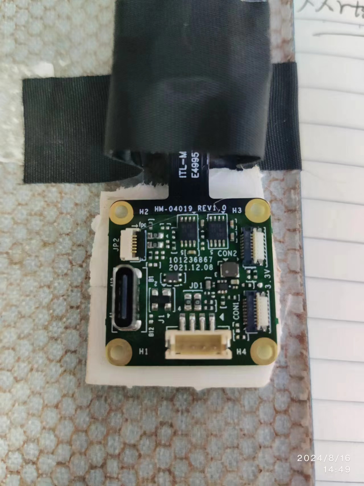

<!--
 * @Descripttion: 
 * @Author: xujg
 * @version: 
 * @Date: 2024-08-16 09:55:07
 * @LastEditTime: 2024-08-21 13:47:26
-->

# 拉流

> 拉流指的是从某个网络源（通常是一个实时流媒体服务器）获取媒体流（视频或音频流）并进行处理或保存的过程。


### 方案一：使用opencv直接处理摄像头视频流

opencv本身就可以直接与摄像头交互，而其实Opencv内部调用了FFmpeg库来处理视频流。

```python
import cv2

# 打开摄像头
cap = cv2.VideoCapture(0)

while True:
    ret, frame = cap.read()
    if not ret:
        break

    # 显示图像
    cv2.imshow('frame', frame)

    # 按q键退出
    if cv2.waitKey(1) & 0xFF == ord('q'):
        break
# 释放摄像头并关闭所有窗口
cap.release()
cv2.destroyAllWindows()
```

### 方案二： 利用libuvc进行拉流

### 1. 安装库文件 libuvc.so
```bash
git clone https://github.com/libuvc/libuvc.git
cd libuvc
mkdir build
cd build
cmake -DCMAKE_BUILD_TYPE=Release ..
make
sudo make install
```

!!! tip
    上面编译过程中需要安装libusb-1.0
    `sudo apt-get install libusb-1.0-0-dev`
    如果存在版本依赖问题，强制安装与libusb-1匹配的版本环境。`sudo apt-get install libusb-1.0-0=2:1.0.25-1ubuntu1`


### 2.设置USB权限
>当插入一个新的摄像头设备时，系统将自动按照这条规则调整设备的用户组和权限，使得所有用户都可以访问设备，而不再需要使用 sudo。这样，可以在不使用 sudo 的情况下运行程序来访问摄像头。

* 在`/etc/udev/rules.d`下新建文件`99-usbcam.rules`
* 打开文件`sudo vim 99-usbcam.rules`, 添加`SUBSYSTEMS=="usb", ENV{DEVTYPE}=="usb_device", ATTRS{idVendor}=="046d", ATTRS{idProduct}=="08cc", MODE="0666"`
* 保存文件并退出
* 重新加载udev规则：
  * `sudo udevadm control --reload-rules`
  * `sudo udevadm trigger`
这将重新加载所有的`udev`规则，并立即应用新的规则.


编译opencv

```bash
cmake -D CMAKE_BUILD_TYPE=Release -D CMAKE_INSTALL_PREFIX=/usr/local -D WITH_GTK=ON ..
make -j$(nproc)
sudo make install
```



- **USB-C 接口**（左侧较大的接口）：
    
    - 这个接口可能是用于数据传输和电源供给的 USB-C 接口。USB-C 是一种通用接口，可以用于连接到计算机或其他主机设备，进行数据传输（例如视频、图像数据）或者为模块供电。
- **小型 FPC 接口**（图片顶部和右侧的扁平连接器）：
    
    - 这些扁平连接器通常用于连接到摄像头传感器模块或其他小型的外围设备。FPC（Flexible Printed Circuit）连接器通常用于在有限空间内连接柔性电缆，与摄像头模块、显示模块、或其他传感器相连。
- **白色小型排针接口**（中间和下方的接口）：
    
    - 这些接口可能用于电源输入或其他控制信号输入/输出。通常情况下，这样的接口可以用于连接到外部电源、信号控制板或其他外围设备，如 GPIO 接口。
- **标注“3.3V”的位置**：
    
    - 这个标注说明附近的接口或电路是工作在 3.3V 电压下的。可能是电源输入、或者电压参考。